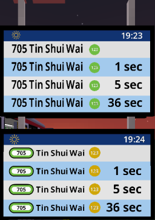
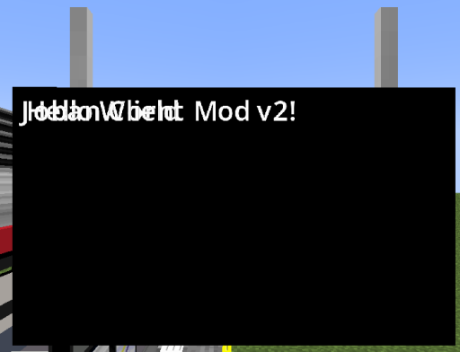
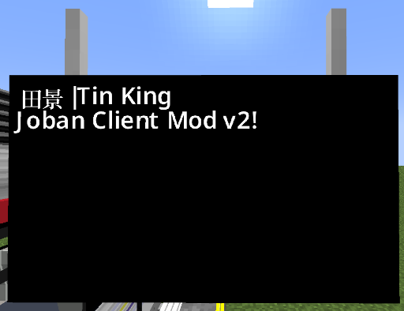
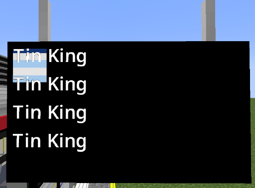
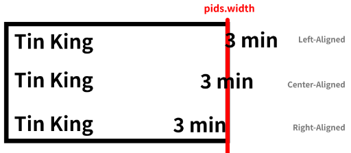
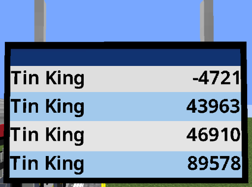
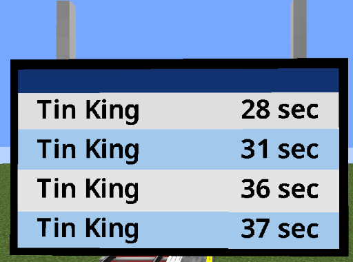
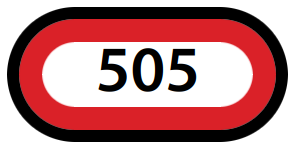
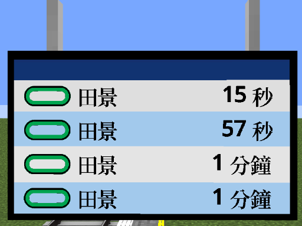
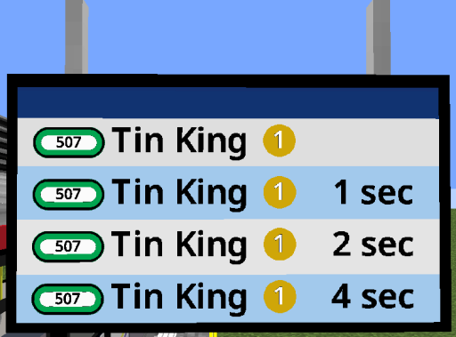

This is a step-by-step tutorial on building a Scripted PIDS Preset using JavaScript.

By the end of the tutorial, you would have built a Fictional LRT (Light Rail) version of the MTR Railway Vision PIDS, which can adapt to Custom PIDS Messages and handling long string.



*(Top: Default RV PIDS Preset, Bottom: Custom JS-based PIDS Preset)*

## Prerequisite
Before beginning this tutorial, you should setup a MTR 4 world:

!!! note inline end
    A fully operational route is not required. If your route jams, the tutorial can still continue, as long as there's any train on the route.

1. Create a route with 2 stations:
    1. 1st station named `屯門碼頭|Tuen Mun Ferry Pier`
    2. 2nd station named `田景|Tin King`
2. Name the route `輕鐵|Light Rail` with Route Number `507` and color code `00A650`
3. Place a single PIDS within your view distance, which can display the arrivals of the routes

## Note
Before starting, please note that:

* Repeated/Irrelevant code may be abbreviated with the `...` notation. You should locate and updating only the affected line.
*Sometimes surrounding codes are shown to ensure the readers don't get lost. The changed line is marked with `<---` at the end of the line, indicating such line is affected.
* This article is best read with basic level of programming knowledge (Doesn't have to be JavaScript). You may still finish the tutorial without such knowledge, but may find some difficulty grasping some concept as this article is not meant to be a programming 101.
* You don't have to finish the tutorial in one go :)

## Getting started
To get started, [download the tutorial resource pack here](https://www.joban.org/archive/misc/JCM_PIDS_Tutorial_Scripting_Pack.zip), extract the zip and put it in Minecraft's Resource Pack folder.

This resource pack is specifically set-up for this tutorial, and therefore the JS scripts inside are (mostly) empty. However we can still take a look at how a Scripted PIDS Preset is set-up.

### joban_custom_resources.json
The file will look like this:
``` json
{
  "pids_images": [
    {
      "id": "pids_tut",
      "name": "DIY JS Preset",
      "scriptFiles": ["jsblock:scripts/pids_tut.js"]
    }
  ]
}
```

This is mostly the same from a JSON PIDS Preset, except the `scriptFiles` property which is a JSON array that points to the scripts used for this preset.

Multiple scripts can be used for the same preset as well. However to keep things simple, we are simply going to use 1 script to control the rendering: `scripts/pids_tut.js`.

### scripts/pids_tut.js
By opening up **pids_tut.js** in the **scripts** folder in a text editor (Notepad etc.), we can see the following script:

```js linenums="1"
function create(ctx, state, pids) {
  // Your custom logic here...
}

function render(ctx, state, pids) {
  // Your custom logic here...
}

function dispose(ctx, state, pids) {
  // Your custom logic here...
}
```

Our custom logic can be placed between each curly brackets for each of the function. As seen, there are a total of 3 functions: `create`, `render`, `dispose`.

- The `create` function is called when our PIDS enters the player's view. So this means that when a player switches the PIDS preset to our preset, or if a player is approaching a station with our PIDS in sight, everything within the curly bracket of the create function will be run.

- The `render` function is called every frame (So 60fps = 60 times per second)*. Notice the asterisk? Because running scripts simply takes time, even if a short amount of time. JCM will *try to*, whenever possible, call your function every frame. However if there are too many scripts or your script is slow, then it may not be called every frame.

- The `dispose` function is called when a PIDS Preset is switched away from, or the PIDS is no longer in sight for the player. This can be used to do clean-up work in complex PIDS that stores texture etc.

The most useful one we are going to use is the `render` function, since this is where we can obtain up-to-date information and dynamically render our PIDS.

But let's not get ahead of ourselves, and instead start from something very simple: *A hello world script*.

### Hello, World!
1. Open up `scripts/pids_tut.js` in your text editor (If you haven't already!)
2. Let's insert `print("Hello World ^^");` to the brackets within the `create` function.
    2. This calls the `print` function with the argument `"Hello World ^^"`. The `print` function will output the message in our Minecraft console.
3. Insert `print("Goodbye World ^^;");` within the `dispose` function as well.

After insertion, your script file should look something like this:

``` js title="pids_tut.js" linenums="1" hl_lines="2 10"
function create(ctx, state, pids) {
    print("Hello World ^^");
}

function render(ctx, state, pids) {
    // Your custom logic here...
}

function dispose(ctx, state, pids) {
    print("Goodbye World ^^;");
}
```

After that, we can press the keybind `F3+T` in Minecraft to reload our resource pack.

Now look at your game console log, you should the following message:

``` linenums="1"
[Scripting] Hello World ^^
[Scripting] Hello World ^^
```

Notice how the message is printed 2 times? That's because PIDS in JCM (and MTR for that matter) are constructed in a way where each side is drawn separately.

Therefore a normal PIDS would call the `create` function 2 times. This is normal behavior, you didn't do anything wrong!

Next, let's try going *very far* away from the PIDS, to the point where you can visually no longer sees them. You will then notice the following 2 messages shows up in the console:

``` linenums="1"
[Scripting] Goodbye World ^^;
[Scripting] Goodbye World ^^;
```

There you have it, a very simple Hello World script running in JCM.

So this concludes the Scripted PIDS tutorial, I hope that...

### No where are you going!
ok I am sorry :<

Now let's actually draw the "Hello World" text onto the PIDS, *because printing to the game console isn't considered exciting for most players apparently*.

We can insert the following code to the `render` function to draw a text with the content **Hello World**:

```js title="pids_tut.js" linenums="5" hl_lines="2"
function render(ctx, state, pids) {
    Text.create().text("Hello World").draw(ctx);
}
```

If this looks confusing, we can also split it line by line in the code:

```js title="pids_tut.js" linenums="5" hl_lines="2-4"
function render(ctx, state, pids) {
    Text.create()
    .text("Hello World")
    .draw(ctx);
}
```

Essentially this code:

- Creates a text object
- Set its text content to `Hello World`
- Draw it to the game! (`ctx` is a provided parameter in the render function, more on that later)

Note that even after splitting it line by line, it is still *valid code*! This is because a statement is only considered finish by ending it with a semicolon (`;`). In fact, it is recommended to split up the lines to maintain readability.

Anyway now let's save the file, reload with F3+T and see what happens!


<small>\*checks date\* It's not April Fools yet is it?</small>

ok ok our text actually *do* actually get rendered. The only problem is that the default text color is black. And as you might have figured out, *black-on-black may not necessarily be a very visible color combination.*

So let's change our text to be rendered with the white color instead.

The hex color code for a solid white color is `FFFFFF`, so we can add the following line to our text:

`.color(0xFFFFFF)` (`0x` is used to depict that the number is a hexadecimal number)

So our text block should look something like this:

``` js linenums="6" hl_lines="3"
Text.create()
.text("Hello World")
.color(0xFFFFFF)
.draw(ctx);
```

*<small>Note that `.draw()` is the final command and you cannot append anything afterwards, so any setting must be appended before `.draw()`.</small>*

Reload the resource pack again and we now see our text!


With this logic, we can append a second Text block to render a 2nd text as well:

```js title="pids_tut.js" linenums="5" hl_lines="7-10"
function render(ctx, state, pids) {
    Text.create()
    .text("Hello World")
    .color(0xFFFFFF)
    .draw(ctx);
    
    Text.create()
    .text("Joban Client Mod v2!")
    .color(0xFFFFFF)
    .draw(ctx);
}
```

  
<small>*I mean it technically did render twice...*</small>

But now they are overlapping and it's hard to see, let's move each of them apart.  
We can use the `.pos(x, y)` command to set the position of an element.

By default, a text have a height of `9`, so we can append `.pos(0, 9)` to set the text position to 9 unit downwards:

``` js title="pids_tut.js" linenums="5" hl_lines="10"
function render(ctx, state, pids) {
    Text.create()
    .text("Hello World")
    .color(0xFFFFFF)
    .draw(ctx);

    Text.create()
    .text("Joban Client Mod v2!")
    .color(0xFFFFFF)
    .pos(0, 9)
    .draw(ctx);
}
```

!!! info inline end "Does the text look a bit weird?"
    You may have noticed the `J` sticking out like a sore thumb, this is unfortunately due to Minecraft's imperfection when rendering TTF font.  
    It will work fine if you switch to Minecraft font or with most other text combination


### Rendering Arrivals
During the tutorial, you might have noticed the `pids` object in the create/render/dispose function. This represents our PIDS object, where we can obtain arrivals and more from there.

We can get a list of arrivals with `pids.arrivals()`, and then obtain the n<sup>th</sup> arrival info with the `.get(n)` function.

So to obtain the first arrival entry, we can do so like this:

``` js title="pids_tut.js" linenums="5" hl_lines="2"
function render(ctx, state, pids) {
    let firstRowArrival = pids.arrivals().get(0);
    // ... rest of your code
```

Remember, JavaScript is 0-based index. The first number starts from 0, then 1, and so on and so fourth...

Now that we have obtained our first arrival entry, we can obtain a variety of information with it, includeing it's route/LRT number, arrival and departure time, the route it's running and much more!

You may refer to the [PIDS Scripting Documentation](../../../scripting/pids.md) for more information, but we will also cover some of it in this tutorial.

At the moment we are only interested in getting the destination (Where the train is going). We can do that by calling the `destination()` function in our arrival entry:

``` js title="pids_tut.js" linenums="5" hl_lines="3"
function render(ctx, state, pids) {
    let firstRowArrival = pids.arrivals().get(0);
    let firstRowDestination = firstRowArrival.destination(); // This is a string!
    // ... rest of your code
```

And now we can replace our previous `Hello World` text content with `firstRowDestination`:

``` js title="pids_tut.js" linenums="5" hl_lines="6"
function render(ctx, state, pids) {
    let firstRowArrival = pids.arrivals().get(0);
    let firstRowDestination = firstRowArrival.destination();
    
    Text.create()
    .text(firstRowDestination)
    .color(0xFFFFFF)
    .draw(ctx);
    
    Text.create()
    .text("Joban Client Mod v2!")
    .color(0xFFFFFF)
    .pos(0, 9)
    .draw(ctx);
}
```



However before we continue, we now have a bit of road block developing:

1. We are obtaining the first arrival here, but what if we don't have a first arrival? What if there's no train running? What if the client is still fetching the arrival infos?
2. Imagine a script filled with `Text.create()`, how would you be able to easily tell which text is which?

Let's tackle the 2nd problem first. One way to do it is to add JavaScript comments with `//` or `/* */`. However JCM also reserved a slot for comment, and that is within the `Text.create(string)` function. So as an example, you can do the following:

``` js hl_lines="1"
Text.create("1st row destination") // <----
.text(firstRowDestination)
.color(0xFFFFFF)
.pos(0, 0)
.draw(ctx);
```

The "**1st row destination**" text (in the above example) is purely cosmetic, and you can write any string within that. As such, this could be served as a slot for commenting. Whether this is preferable depends on your personal preferences.

Now back to the first problem, you may have already noticed some error popping up in your console log during some part of the tutorial. This is because we are trying to obtain a non-existent arrival.

For that, we can add a null check to ensure that the arrival exists first:

``` js title="pids_tut.js" linenums="5" hl_lines="3 4 11"
function render(ctx, state, pids) {
    let firstRowArrival = pids.arrivals().get(0);
    if(firstRowArrival != null) { // Check if arrival exists first
        let firstRowDestination = firstRowArrival.destination();

        Text.create("1st row destination")
        .text(firstRowDestination)
        .color(0xFFFFFF)
        .pos(0, 0)
        .draw(ctx);
    }
    // ... rest of the text
}
```

Great! However while this might be fine for rendering 1 line of arrival, in practice we often have to display much more than that.  
While we could just copy and paste these codes, they are error-prune and a mess to modify.

Making matters more complicated, different PIDS Block have it's own number of arrival entry it supports.  
For example, [RV PIDS](../../../../players/blocks/rv_pids.md) supports 4 rows, while [PIDS 1A](../../../../players/blocks/pids_1a.md) only supports 3 rows.

One solution is to change this to a for-loop. We can use `pids.rows` to obtain how many rows the current PIDS block supports:

``` js title="pids_tut.js" linenums="5" hl_lines="2 3 8 11"
function render(ctx, state, pids) {
    for(let i = 0; i < pids.rows; i++) { // Set i to 0. i++ if i < pids.rows, otherwise don't run this anymore
        let arrival = pids.arrivals().get(i); // <---- Obtain nth row arrival
        if(arrival != null) {
            Text.create("Arrival destination")
            .text(arrival.destination())
            .color(0xFFFFFF)
            .pos(0, i*9) // <--- nth row * text height
            .draw(ctx);
        }
    }
}
```

The runs everything within the for loop for however many rows the pids has, setting the `i` variable to the n<sup>th</sup> time our code is executed.


As such, we can use `i` to determine our Y position as well as which arrival to obtain.


Of course, if your layout is not designed to be dynamic, and are designed for a specific PIDS, you can hardcode a number in (e.g. `4`) instead of `pids.rows`.

#### Text size & Language Cycle
To resize a text, we can use the `.scale(factor)` function to scale the text to be larger or smaller.

In our case, we will scale it by 1.25x:

``` js title="pids_tut.js" linenums="8" hl_lines="6"
/// ... code before
Text.create("Arrival destination")
.text(arrival.destination())
.color(0xFFFFFF)
.pos(0, i*9)
.scale(1.25) // Scale the text by 1.25x
.draw(ctx);
/// ... code after
```


The text does seems to be larger! But they are now too close to each other, and are really uncomfortable to look at.

This is because earlier, we set the position of the text to be `.pos(0, i*9)`. However since our text is scaled, the text height is no longer `9`, but instead `9 (text height) * 1.25 (our scale)` = 11.25.

While we could just change it to `11.25`, let's leave even more padding between each row for a better-look.  
Let's say each row should go **16.75** unit downwards:

``` js title="pids_tut.js" linenums="8" hl_lines="5"
/// ... code before
Text.create("Arrival destination")
.text(arrival.destination())
.color(0xFFFFFF)
.pos(0, i*16.75)
.scale(1.25)
.draw(ctx);
/// ... code after
```


Much better! The last thing we have to deal with is handling different languages. Currently it's just displayed with everything including the pipe character, which is used by MTR as a way to split languages apart.

To cycle the string, we can wrap our destination string with the `TextUtil.cycleString(str)` function.

`TextUtil` is a utility method provided our of the box for us, you can check the [Utilities](../../../scripting/utilities.md) page for more helper functions like these.

``` js title="pids_tut.js" linenums="8" hl_lines="3"
/// ... code before
Text.create("Arrival destination")
.text(TextUtil.cycleString(arrival.destination()))
.color(0xFFFFFF)
.pos(0, i*16.75)
.scale(1.25)
.draw(ctx);
/// ... code after
```

And there we go, now the text cycles!


So to re-cap, our code should look *similar* to this:

``` js title="pids_tut.js" linenums="1"
function create(ctx, state, pids) {
    print("Hello World ^^");
}

function render(ctx, state, pids) {
    for(let i = 0; i < pids.rows; i++) {
        let arrival = pids.arrivals().get(i);
        if(arrival != null) {
            Text.create("Arrival destination")
            .text(TextUtil.cycleString(arrival.destination()))
            .color(0xFFFFFF)
            .pos(0, i*16.75)
            .scale(1.25)
            .draw(ctx);
        }
    }
}

function dispose(ctx, state, pids) {
    print("Goodbye World ^^;");
}
```

## v1: Not too bad after-all!
In the last section we've spent all that time rendering some black-on-white text, but still it doesn't really look good.

The next thing we are going to do is to draw a background alongside the PIDS text. This is very similar to the way we make text, but we use `Texture` instead, as well as the `.texture(id)` function to specify the image we would draw:

``` js title="pids_tut.js" linenums="4" hl_lines="15-17"
/// ... code before
function render(ctx, state, pids) {
    for(let i = 0; i < pids.rows; i++) {
        let arrival = pids.arrivals().get(i);
        if(arrival != null) {
            Text.create("Arrival destination")
            .text(TextUtil.cycleString(arrival.destination()))
            .color(0xFFFFFF)
            .pos(0, i*16.75)
            .scale(1.25)
            .draw(ctx);
        }
    }

    Texture.create("Background")
    .texture("jsblock:textures/block/pids/rv_default.png") // (1)!
    .draw(ctx);
}
/// ... code after
```

1. `jsblock:textures/block/pids/rv_default.png` is the default image used for the built-in Railway Vision PIDS that comes with JCM.<br>Of course, you are welcomed to bring your own images as well!

Now reload the resource pack and...


On the surface it seems that the only thing wrong is the positioning & sizing (Which to be fair, we didn't tell JCM the size, so it uses the default). However another problem is that the image is appearing *over* the text, which is not what you want for a *background* image.

### Stacking Order
In JCM, every elements that gets drawn are rendered with their z-position incremented ever so slightly.

Therefore, the 2nd element to be drawn is placed *in-front* of the 1st element.

So the rule is pretty simple: Whoever gets rendered **later** are put **in-front**, and whoever gets rendered **earlier** are **behind** the one who are rendered later.

With this logic, let's move our background image to the **top** of the render function, so that everything afterwards are drawn on in-front of the background.

``` js title="pids_tut.js" linenums="4" hl_lines="3-5"
/// ... code before
function render(ctx, state, pids) {
    Texture.create("Background")
    .texture("jsblock:textures/block/pids/rv_default.png")
    .draw(ctx);

    for(let i = 0; i < 4; i++) {
        let arrival = pids.arrivals().get(i);
        if(arrival != null) {
            Text.create("Arrival destination")
            .text(TextUtil.cycleString(arrival.destination()))
            .color(0xFFFFFF)
            .pos(0, i*16.75)
            .scale(1.25)
            .draw(ctx);
        }
    }
}
/// ... code after
```



Now we just need to resize the texture to stretch it through the entire screen.

This can be done through the `.size(width, height)` function:

``` js title="pids_tut.js" linenums="5" hl_lines="4"
/// ... code before
Texture.create("Background")
.texture("jsblock:textures/block/pids/rv_default.png")
.size(80, 80)
.draw(ctx);
/// ... code after
```

Hmm `80, 80`? That's a square, not a rectangle like our PIDS screen?

That's correct, this code indeed does not cover the entire screen. A Railway Vision PIDS uses the size 136w x 76h.

While we could just change the size to `136, 76`, we can also obtain the size of the PIDS directly with the `pids` variable passed to our render function, specifically `pids.width` and `pids.height`:

``` js title="pids_tut.js" linenums="5" hl_lines="4"
/// ... code before
Texture.create("Background")
.texture("jsblock:textures/block/pids/rv_default.png")
.size(pids.width, pids.height)
.draw(ctx);
/// ... code before
```

This is useful both for readability purposes, as well as factoring in different sizes of PIDS. (An LCD PIDS screen is slightly smaller at 133w x 72h)

And let's not forget setting our destination text color to black (`0x000000`, or just remove `.color` entirely as it's black by default anyway), as the background is now bright.


The background image itself appears to include a header bar, which our arrival text has not accounted for.

A very straight forward fix is to just offset the text's Y position. To save you time, I have tested the value for you, and it is `13` is the sweet spot :)

``` js title="pids_tut.js" linenums="13" hl_lines="4"
/// ... code before
Text.create("Arrival destination")
.text(TextUtil.cycleString(arrival.destination()))
.pos(0, 13+(i*16.75))
.scale(1.25)
.draw(ctx);
/// ... code before
```

Ok now things are getting crazy. Imagine if you give this to a friend for a reference, or even just you reading this a year later. Could you tell what that `13` is for, and why `i*16.75`?

In such case, we should declare a variable to give our value a name:

``` js title="pids_tut.js" linenums="5" hl_lines="5 11"
function render(ctx, state, pids) {
    // ...background

    for(let i = 0; i < 4; i++) {
        let rowY = 13 + (i*16.75);
        
        let arrival = pids.arrivals().get(i);
        if(arrival != null) {
            Text.create("Arrival destination")
            .text(TextUtil.cycleString(arrival.destination()))
            .pos(0, rowY)
            .scale(1.25)
            .draw(ctx);
        }
    }
}
```

As for the `13`, since it won't be changed at runtime, we can use the `const` keyword to indicate that this is a constant variable and would never change:

``` js title="pids_tut.js" linenums="1" hl_lines="1 10"
const HEADER_HEIGHT = 13;

function create(ctx, state, pids) {
    // ... code
}

function render(ctx, state, pids) {
    // ... code before
    for(let i = 0; i < pids.rows; i++) {
        let rowY = HEADER_HEIGHT + (i*16.75);
        let arrival = pids.arrivals().get(i);
        // ...
    }
    // ... code after
}
// ... code
```

Neat!


### Estimated Arrival Time Text
Showing the destination is cool, but wouldn't it be even better if players can see when does the next train arrives? Let's add that as well, following the regular RV PIDS Layout which aligns the text to the right-most screen.

As we have learnt previously, we can get the width of the pids via `pids.width`, so what we could do is to set the text's `x` position to the width so that it renders at the end of the screen.

``` js title="pids_tut.js" linenums="7" hl_lines="15"
function render(ctx, state, pids) {
    // ... code for drawing background
    for(let i = 0; i < pids.rows; i++) {
        let rowY = HEADER_HEIGHT + (i*16.75);
        let arrival = pids.arrivals().get(i);
        if(arrival != null) {
            Text.create("Arrival destination")
            .text(TextUtil.cycleString(arrival.destination()))
            .pos(0, rowY)
            .scale(1.25)
            .draw(ctx);
            
            Text.create("Arrival ETA")
            .text("3 min") // Dummy ETA text for now
            .pos(pids.width, rowY)
            .scale(1.25)
            .draw(ctx);
        }
    }
}
```

!!! note inline end
    Here serves as another reminder that the contents we have rendered so far are drawn *physically* in the world.

    JCM does not create a texture for you to render the screen on, as such your elements can go out of the screen entirely, even out of the PIDS block itself.

  
<small>... oh well that's a bit more than the end of screen ^^;</small>

Now the code is indeed doing what we told it to do: **Render text at the end of the screen.**  
However the issue is that under the default text configuration, the text is **left-aligned**, and thus the x we give it is just the *starting point* of the text.

  
<small>Illustration of the issue we are facing</small>

To fix the issue, we need to **right-align** the text, to do that we can simply append `.rightAlign()` to our text:

``` js title="pids_tut.js" hl_lines="6"
// ... code before
Text.create("Arrival ETA")
.text("3 min")
.pos(pids.width, rowY)
.scale(1.25)
.rightAlign()
.draw(ctx);
// ... code after
```


The text margin is still not perfect, but it's just a matter of doing some subtraction, which we can do later.

Now let's move on to functionality:  
As we have previously established, we can obtain the arrival's destination text with the `destination()` function.

An arrival entry have more functions than that. For a full list you can check [ArrivalWrapper](../../../scripting/pids.md#arrivalswrapper).

For our purposes, we are going to use the `arrivalTime()` function. This returns the **epoch time** the train is arriving at (in millisecond), or in other word, how many millisecond (1/1000th of a second) have passed since 1 January 1970.

This in of itself is not that useful, but we can use JavaScript's Date Object `Date.now()` to obtain the same thing, except referring to the time now. This also means we can use that to compare the time between now and the arrival time!

``` js title="pids_tut.js" hl_lines="2 4"
// ... code before
let eta = arrival.arrivalTime() - Date.now(); // Difference between our estimated arrival time (future) and now
Text.create("Arrival ETA")
.text(eta) // Change the text to render our eta
.pos(pids.width, rowY)
// ... code after
```

Now you should see umm... big numbers rapidly counting down:



If you are lucky enough to have a train stopping during this (As seen above), you'll see that the number rolls to the negative. This is because the train have *already arrived*.

So for example `-4721` here means that the train have already arrived for **4.721** second, while `43963` means that the train will arrive in **43.963** second, since the number is represented in millisecond (1/1000th of a second).

As such, we can obtain the second remaining by dividing it by 1000:

```js title="pids_tut.js" hl_lines="2"
// ... code before
let eta = (arrival.arrivalTime() - Date.now()) / 1000;
Text.create("Arrival ETA")
.text(eta)
// ... code after
```

  

Now we just need to round the number to get a full integer:

```js title="pids_tut.js" hl_lines="2"
// ... code before
let eta = Math.round((arrival.arrivalTime() - Date.now()) / 1000);
Text.create("Arrival ETA")
.text(eta)
// ... code after
```

We could continue implementing like this, however I'll leave this as an exercise to the viewer after finish this tutorial :)

Instead for now we can go the slightly lazy route: JCM have included a helper script by default, namely **PIDSUtil**, which have a function to automatically format ETA text.

Here, we can use the `include()` function to import the PIDSUtil script:

```js title="pids_tut.js" linenums="1" hl_lines="1"
include(Resources.id("jsblock:scripts/pids_util.js")); // Built-in script shipped with JCM
// ... Rest of the script
```  

!!! note
    We can only include scripts while JCM is parsing the script (i.e. Outside of function). It is not possible to put them in the `render` function for example, as by that time JCM has already finished parsing the entire script, and it's only calling your function.

Now that we have imported the script, we can now use it's function, `PIDSUtil.getETAText(time: number)`:

``` js title="pids_tut.js" hl_lines="3"
// ... code before
Text.create("Arrival ETA")
.text(PIDSUtil.getETAText(arrival.arrivalTime()))
.pos(pids.width, rowY)
.scale(1.25)
.rightAlign()
.draw(ctx);
// ... code after
```

After reloading, you should see that it returns a raw string without any language separation. However more importantly the unit is correct. (mins/sec)


And as we have learnt from handling the destination text, we can wrap it with `TextUtil.cycleString()`:

``` js title="pids_tut.js" hl_lines="3"
// ... code before
Text.create("Arrival ETA")
.text(TextUtil.cycleString(PIDSUtil.getETAText(arrival.arrivalTime())))
// ... code after
```

And finally to not start a war, let's apply some spacing to both the destination and ETA text so it doesn't lean along the edge:

```js title="pids_tut.js" hl_lines="4 9"
// ... code before
Text.create("Arrival destination")
// ... code
.pos(8, rowY)
// ... code
            
Text.create("Arrival ETA")
// ... code
.pos(pids.width - 8, rowY)
// ... code after
```


## v2: Light Rail, Light Rail Everywhere!
Now it's time to add the light rail route symbol.

First, let's move our destination text to the right, 30 unit to be exact, so we can reserve some space for our light rail symbol on the left:

``` js title="pids_tut.js" hl_lines="4"
// ... code before
Text.create("Arrival destination")
// ...
.pos(30, rowY)
// ... code after
```

### Drawing the Light Rail Symbol
For reference, this is the symbol used for Hong Kong Light Rail Route:

  
<small>This is a replica render of the symbol, but should look close-enough</small>

It is consisted of a pill with white-background, followed by a thick route colored border, and a black border inside that.

To understand how we should approach this, let's take a look at the resource file provided in the tutorial resource pack, under `assets/jsblock/textures/lrr.png`:

  
<small>The texture quality itself is... not the greatest, but let me be lazy while I can get away with it :P</small>

Essentially this is just the above version, but without the centered white part, and the route color being white.

The reason why it's white is because we will be tinting the texture color to follow our route color.  
An easier way to think of it is "*how white the color is = how bright the color is*".

This means that the white-part will be colored to our route's color, while the black border remains black, because it's brightness is essentially 0%. No matter how you tint black, it's still black.

As for the centered pill-shaped part, we have to draw it separately, as that part shall not be tinted with our route color. So let's get started!

``` js title="pids_tut.js" hl_lines="2-7"
// ... code before
Texture.create("LRT Circle Colored")
.texture("jsblock:textures/lrr.png")
.color(arrival.routeColor()) // Note this part!
.pos(5, rowY)
.size(23, 10)
.draw(ctx);

Text.create("Arrival destination")
// ... code after
```

Essentially this draws our texture `jsblock:textures/lrr.png`, with the color set (or tinted) to the arrival's route color. The rest is just stuff we have learnt in the past :D



Nice, we are already 60% there. Now we just need to fill the white pill-shaped background.

There are multiple ways to achieve that, but the one we are going to use in the tutorial is to layer a white rectangle behind the pill-shaped symbol:

  
<small>Imagine the green border as the border the white rectangle, which is placed behind our symbol</small>

``` js title="pids_tut.js" hl_lines="2-6"
// ... code before
Texture.create("LRT Circle White")
.texture("mtr:textures/block/white.png")
.pos(7.5, rowY+1.5)
.size(18, 6)
.draw(ctx);
        
Texture.create("LRT Circle Colored")
.texture("jsblock:textures/lrr.png")
// ... code after
```

Again, remember first to draw, first to be covered. It needs to be drawn first before the colored pill, so that it can stay behind the colored pill.

!!! note inline end "(Self Note)"
    Maybe it does make sense to implement `Rectangle` alongside `Text` and `Texture` as well... but for now this will do!

Also worth nothing is the texture `mtr:textures/block/white.png`. This is a built-in texture in MTR that's literally just a solid white color, which can coincidentally be used in this situation.

Nothing note-worthy other than that however. The position and size is already given for the sake of this tutorial, but in practice you may need some trial and error to get it right.

Now we just need to draw the route number, *do it after we draw the pill so it stays on top*:

``` js title="pids_tut.js" hl_lines="6-11"
// ... code before
Texture.create("LRT Circle Colored")
// ...
.draw(ctx);

Text.create("LRT Number Text")
.text(arrival.routeNumber())
.scale(0.55)
.centerAlign()
.pos(16.5, rowY+3)
.draw(ctx);
// .. code after
```

As for the platform number, here's the code as there's not a lot of things worth noting either:

``` js title="pids_tut.js" hl_lines="6-11 13-19"
// ... code before
Text.create("Destination Text")
// ...
.draw(ctx);

Texture.create("Platform Circle") // Draw our circle texture
.texture("jsblock:textures/block/pids/plat_circle.png") // Built-in to JCM
.pos(79, rowY - 1)
.size(10.5, 10.5)
.color(0xD2A808) // #D2A808 is color for HK LRT Network
.draw(ctx);
            
Text.create("Platform Circle Text") // Draw the text
.text(arrival.platformName()) // We can use platformName() to obtain the platform no.
.pos(84, rowY + 1)
.scale(0.9)
.centerAlign()
.color(0xFFFFFF) // #FFFFFF is white text
.draw(ctx);
// ... code after
```

Just to keep you *in the loop <small>(Pun intended)</small>*, what we are doing so far is ran for each arrival row, because we have setup a *for-loop* at the top.

So if you are going to render thing one-time on the screen, then you should place the logic *outside* this loop~



Not bad!

## v3: The PIDS called, they wanted their header bar back
The header bar is the blue bar at the top. The built-in RV PIDS preset in JCM contains a weather texture on the left, and a 24-hour clock on the right.

### Weather Icon
There are 3 distinct texture for weather icon used in the default RV PIDS preset:
{| class="wikitable"
|+
!Texture ID
!Used when
|-
|`jsblock:textures/block/pids/weather_sunny.png`
|There are no rain nor thunderstorm in the current world.
|-
|`jsblock:textures/block/pids/weather_rainy.png`
|There are rain, but not thunderstorm in the current world.
|-
|`jsblock:textures/block/pids/weather_thunder.png`
|There are a thunderstorm in the current world.
|}
As such, we need to use different texture depending on the situation.

To check the weather for the current world, we can use the [[JCM:Scripting:Documentation:Utilities#MinecraftClient|MinecraftClient]] class, which provides a couple of functions, namely `MinecraftClient.worldIsRaining()` and `MinecraftClient.worldIsThundering()`.

We can then first declare a variable which represents the texture we are going to use, we are going to assign a value to it later:

```
let weatherImg;
```

*Note: Remember to place this outside the arrival for-loop as this is only meant to be drawn 1 time, but also after we drawn the Background texture, as we don't want the background to cover our image.*

Now we can start checking from the order thunderstorm > raining > sunny, and assign the appropriate texture ID:```
if(MinecraftClient.worldIsThundering()) {
    weatherImg = "jsblock:textures/block/pids/weather_thunder.png";
} else if(MinecraftClient.worldIsRaining()) {
    weatherImg = "jsblock:textures/block/pids/weather_raining.png";
} else {
    weatherImg = "jsblock:textures/block/pids/weather_sunny.png";
}
```(The reason why we have to check in this order is because when a thunderstorm is active, it is also considered raining. Therefore we can't check if it's raining first, as otherwise it will always use the rainy texture. And finally if it's neither raining nor thundering, then the sky has to be clear.)

Now, let's draw the texture with our `weatherImg` variable:```
Texture.create("Weather Icon")
.texture(weatherImg)
.pos(5, 0)
.size(10, 10)
.draw(ctx);
```

### Clock
PIDSUtil once again provides a utility function for us to call so we don't have to manually create it:```
Text.create("Clock")
.text(PIDSUtil.formatTime(MinecraftClient.worldDayTime(), true))
.color(0xFFFFFF)
.pos(pids.width - 5, 2)
.scale(0.9)
.rightAlign()
.draw(ctx);
```The function parameter is `PIDSUtil.formatTime(minecraftTime, shouldPadZero)`.

We can fill the `minecraftTime` parameter with `MinecraftClient.worldDayTime()`, which gets the [https://minecraft.fandom.com/wiki/Daylight_cycle#Minecraft_time_to_real_time Minecraft time in tick].

As for `shouldPadZero`, we set it to true so it returns something like `08:30` instead of `8:30`.

[[File:JCM JS PIDS Tutorial v3.1.png|313x313px]]

## v4: Go ham!
Right now things are looking very solid, but this is the MTR Mod we are talking about, so things quickly falls apart when someone enter `Llanfair­pwllgwyngyll­gogery­chwyrn­drobwll­llan­tysilio­gogo­goch` as their station name.

"*Of course I am not silly enough to do that*" Ok sure but now let's look at a real-world example, by renaming your destination station from `田景|Tin King` to `天水圍|Tin Shui Wai`

*(p.s. if you know the HK LRT network well enough and are nerdy-enough, you can set your route number to `705` and route color to `#71BE44` to match real-world situation)*

[[File:JCM JS PIDS Tutorial v4.1.png|362x362px]]*ummm send help.*

### Limiting text size
As we had learnt, we can set the size of a texture with `size(w, h)` function. What you might not know however is that the same can actually be done with text, try it:

```
Text.create("Arrival destination")
.text(TextUtil.cycleString(arrival.destination()))
.pos(30, rowY)
.size(36, 9) // <----
.scale(1.25)
.draw(ctx);
```

After reloading, you'll notice that nothing has changed at all.

This is intended, the text area did got defined. However by default JCM don't take any action if the text overflowed.

To do so, we need to tell JCM what to do, either with the `stretchXY()`, `scaleXY()`, `wrapText()` and `marquee()` function.

With `stretchXY()`, the text will be stretched according to which axis it overflowed. So if it overflowed horizontally, the text will only be stretched horizontally.

With `scaleXY()`, the text will be stretched on both-axis to ensure that it stays within the defined size. Or in other word, it maintains the aspect ratio of the text.

With `wrapText()`, any text that overflowed will be rendered in the next line, this might be useful when rendering paragraphs of text.

With `marquee()`, the text content is cropped to only show the visible section. The text will be continuously shifted to ensure that all portion of the text is shown.

For now, we'll go with `scaleXY()` as I think it looks nicer, feel free to try others however!

```
Text.create("Arrival destination")
.text(TextUtil.cycleString(arrival.destination()))
.pos(30, rowY)
.size(36, 9)
.scaleXY() // <----
.scale(1.25)
.draw(ctx);
```

[[File:JCM JS PIDS Tutorial v4.2.png|417x417px]]

Nice. Now, we can also apply the same logic elsewhere:

```
Text.create("LRT Number Text")
.text(arrival.routeNumber())
.scale(0.55)
.centerAlign()
.size(26, 9) // <----
.scaleXY() // <----
.pos(16.5, rowY+2.75)
.draw(ctx);
```

```
Text.create("Platform Circle Text")
.text(arrival.platformName()) // We can use platformName() to obtain the platform no.
.size(9, 9) // <----
.scaleXY() // <----
.pos(84, rowY + 1)
.scale(0.9)
.centerAlign()
.color(0xFFFFFF)
.draw(ctx);
```

```
Text.create("ETA Text")
.text(TextUtil.cycleString(PIDSUtil.getETAText(arrival.arrivalTime())))
.scale(1.25)
.size(30, 9) // <----
.scaleXY() // <----
.rightAlign()
.pos(pids.width - 8, rowY)
.draw(ctx);
```

== v5: It's coming together ==
At this point if you are developing this PIDS Preset for your own use, you should be ready to go by modifying the code to suit your need.

However if you are planning to publish a PIDS Preset for others to use, you have to also account for the variety of different configuration people uses. Most notably, each PIDS Block has it's own config, such as **Custom Messages**, **Hide Arrivals**, **Hide Platform Number** etc.

This section will go through how to take these configs into account as well.

=== Custom Message ===
We can obtain the custom message of the n<sup>th</sup> row by using the function `pids.getCustomMessage(n)`

If a custom message exists, it will return the custom message.

Otherwise, it will return an empty string ("")

Therefore, we can check whether that row have custom messages, and draw them differently depending on the situation:

```
...

let customMsg = pids.getCustomMessage(i);
if(customMsg != "") { // Have custom message
    Text.create("Custom Text")
    .text(TextUtil.cycleString(customMsg))
    .scale(1.25)
    .size(pids.width-10, 9) // -10 to account for padding on both sides
    .scaleXY()
    .pos(5, rowY)
    .draw(ctx);
} else { // No custom message, continue the rest of arrival row logic
    let arrival = pids.arrivals().get(i);
    if(arrival != null) {
    ...
}

...
```

=== Hide Platform Number ===
We can use the `pids.isPlatformNumberHidden()` to determine whether platform number should be shown or not:```
if(!pids.isPlatformNumberHidden()) { // If platform number is not hidden
    Texture.create("Platform Circle")
    .texture("jsblock:textures/block/pids/plat_circle.png")
    ...
}
```

### Hide Arrival
We can use the `pids.isRowHidden(n)` function to determine whether arrival is set to hidden on that row:

```
let arrival = pids.arrivals().get(i);
if(arrival != null && !pids.isRowHidden(i)) { // have arrival & row not hidden
    ... // Our arrival rendering logic
}
```

### Conclusion
Congratulations! You have just built your custom PIDS preset from scratch!

Here's the full code for your reference (May differ slightly, but logic should mostly be same):

```
include(Resources.id("jsblock:scripts/pids_util.js")); // Built-in script shipped with JCM
const HEADER_HEIGHT = 13;

function create(ctx, state, pids) {
    print("Hello World ^^");  // Only for testing, can remove
}

function render(ctx, state, pids) {
    Texture.create("Background")
    .texture("jsblock:textures/block/pids/rv_default.png")
    .size(pids.width, pids.height)
    .draw(ctx);
    
    // Top Bar
    // Draw weather icon
    let weatherImg;
    if(MinecraftClient.worldIsThundering()) {
        weatherImg = "jsblock:textures/block/pids/weather_thunder.png";
    } else if(MinecraftClient.worldIsRaining()) {
        weatherImg = "jsblock:textures/block/pids/weather_raining.png";
    } else {
        weatherImg = "jsblock:textures/block/pids/weather_sunny.png";
    }
    
    Texture.create("Weather Icon")
    .texture(weatherImg)
    .pos(5, 0)
    .size(10, 10)
    .draw(ctx);
    
    Text.create("Clock")
    .text(PIDSUtil.formatTime(MinecraftClient.worldDayTime(), true))
    .color(0xFFFFFF)
    .pos(pids.width - 5, 2)
    .scale(0.9)
    .rightAlign()
    .draw(ctx);
    
    // Arrivals
    for(let i = 0; i < pids.rows; i++) {
        let rowY = HEADER_HEIGHT + (i*16.75);
        let customMsg = pids.getCustomMessage(i);
        if(customMsg != "") {
            Text.create("Custom Text")
            .text(TextUtil.cycleString(customMsg))
            .scale(1.25)
            .size(pids.width - (5*2), 9)
            .scaleXY()
            .pos(5, rowY)
            .draw(ctx);
        } else {
            let arrival = pids.arrivals().get(i);
            if(arrival != null && !pids.isRowHidden(i)) {
                Texture.create("LRT Circle White")
                .texture("mtr:textures/block/white.png")
                .pos(7.5, rowY+1.5)
                .size(18, 6)
                .draw(ctx);
                
                Texture.create("LRT Circle Colored")
                .texture("jsblock:textures/lrr.png")
                .color(arrival.routeColor())
                .pos(5, rowY)
                .size(23, 10)
                .draw(ctx);
                
                Text.create("LRT Number Text")
                .text(arrival.routeNumber())
                .scale(0.55)
                .centerAlign()
                .size(26, 9)
                .scaleXY()
                .pos(16.5, rowY+3)
                .draw(ctx);
                
                Text.create("Arrival Destination")
                .text(TextUtil.cycleString(arrival.destination()))
                .scale(1.25)
                .size(36, 9)
                .scaleXY()
                .pos(30, rowY)
                .draw(ctx);
                
                if(!pids.isPlatformNumberHidden()) {
                    Texture.create("Platform Circle")
                    .texture("jsblock:textures/block/pids/plat_circle.png")
                    .pos(79, rowY - 1)
                    .size(10.5, 10.5)
                    .color(0xD2A808) // Hong Kong LRT Network Color
                    .draw(ctx);
                    
                    Text.create("Platform Circle Text")
                    .text(arrival.platformName())
                    .pos(84, rowY + 1)
                    .size(9, 9)
                    .scaleXY()
                    .scale(0.9)
                    .centerAlign()
                    .color(0xFFFFFF)
                    .draw(ctx);
                }
                
                Text.create("ETA Text")
                .text(TextUtil.cycleString(PIDSUtil.getETAText(arrival.arrivalTime())))
                .scale(1.25)
                .size(30, 9)
                .scaleXY()
                .rightAlign()
                .pos(pids.width - 8, rowY)
                .draw(ctx);
            }
        }
    }
}

function dispose(ctx, state, pids) {
    print("Goodbye World ^^;"); // Only for testing, can remove
}
```

## What to do next
Now you can check out the [[JCM:Scripting:Documentation|scripting documentation]] to see what other functions and information you can obtain.

### Additional Challenges
Some things are intentionally left-out in this tutorial, which can mostly be attributed to my laziness, but nevertheless they also serve as a great opportunity for a bonus challenge:

#### Re-implementing functions in PIDSUtil
On multiple occasions we have used **PIDSUtil** to obtain for example ETA Text, formatting clock etc.

Now can you create your own function to replace the use of PIDSUtil?

##### PIDSUtil.getETAText(arrivalMs)
Tips:

* Check if arrival second is <= 0, if so return an empty string
* If arrival second less than 60, return `<etaSec> 秒|<etaSec> sec`
* If arrival second less than 120, return `<etaMin> 分鐘|<etaMin> min`
* Otherwise, return `<etaMin> 分鐘|<etaMin> mins`
* Use `Math.floor` and `Math.ceil` to round down/up numbers

##### PIDSUtil.formatTime(mcTime)
Tips:

* Every in-game hour is `50` second in real life, or exactly `1000` ticks.
* Minecraft Time is `0` at `06:00`, add `6000` ticks to the Minecraft time before doing calculations.
* Convert a number to string with `.toString()` function.
* Pad zero digits on a string with `.padStart(2, '0')`

#### Show car length if arrivals have mixed car length
Tips:

* Read the [[JCM:Scripting:Documentation:PIDS#PIDS Object Related|documentation]] to see whether there's a function to determine if arrivals have mixed car length
* Use `PIDSUtil.getCarText(carLength)` function to obtain the car text.
* Append the car text to the ETA string with a `|` so that it cycles through both car-text and ETA-text!

## Ending
This concludes the PIDS tutorial. If you have any question or feedback, please don't hesitate to send it either in the District of Joban server, or the JCM thread in the Minecraft Transit Railway server! See you by then~ ^-^

- LX