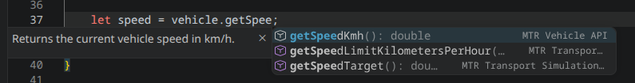

# VSCode Intellisense

!!! info "Not official extension"
    This page merely lists 3rd party efforts. Any issues or suggestions should be submitted to the extension author.

Due the custom class types available in JCM scripting, sometimes it may be hard to grasp or make mistakes during the script development process.

For those using **Visual Studio Code**, a 3rd party extension is available for use which provides intellisense for types in JCM.

## Download
- [Visual Studio Marketplace](https://marketplace.visualstudio.com/items?itemName=huliawsl.mtr-scripting-tools)
- [Open VSX](https://open-vsx.org/extension/huliawsl/mtr-scripting-tools)