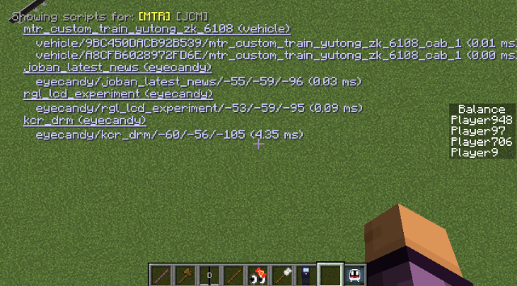
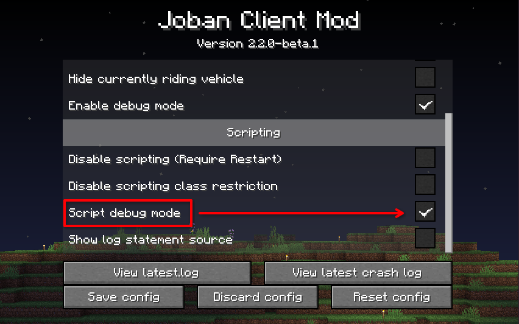
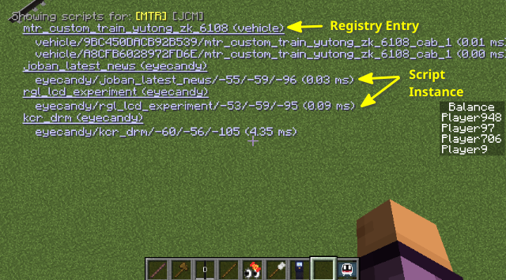

# Script Debug Overlay

To better visualize errors and performance of your script, you can turn on Script Debug Overlay, which enables an in-game HUD overlay, showing all script instances that are currently executed.

### Enable the overlay
Go to **Mod Menu** / **Mod Config Screen** (Forge), find JCM and click on **Configure**.  
After that, make sure the **Script debug mode** checkbox is checked, then click **Save Config**.

### How to read the overlay

- For each underlined text, it represents a registry entry of the script. The type of scripts are appended after the text (e.g. `(eyecandy)`)
    - For each indented items, it represents an instance of the script. Note that these instances are "virtual", as in there's still only a single instance of your script, but to keep track of the state variables and draw calls, JCM uses a concept called instance to associate data for each uniquely identifiable script objects in the world, and invoke the `render()` function with values from different instances.
    - There are 3 colors for each instances: **Blue (Normal)**, **Yellow (Slightly slow execution)** and **Red (Relatively slow execution)**.
    - Script developers should generally aim for the Blue color if possible.

### Navigate between sources
Since mixing all script instances into 1 view would clutter up the overlay, the overlay are separated by different "source". For instance, it will only show scripts coming from **[MTR]** (Vehicle/Eyecandy Scripting), and **[JCM]** (PIDS Scripting).

You can press `[` and `]` on your keyboard to select between them, they are also configurable in keybind settings in-case a conflict occurs.