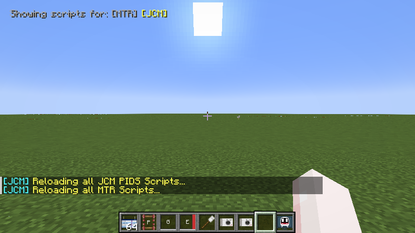

# Quick Reload

Since scripting is a part of a resource pack, to reload a script you usually have to reload the resource in-game by pressing F3+T.

To aid development time, **JCM v2.1.2** introduced a new quick reload feature which allows reloading of scripts without going through the normal resource pack reloading routine.

### Enable quick reload
Go to **Mod Menu** / **Mod Config Screen** (Forge), find JCM and click on **Configure**.  
After that, make sure the **Enable debug mode** checkbox is checked, then click **Save Config**.

### Using quick reload
After enabling debug mode, you can press the following key combination:

- `Shift+R` to reload JCM scripts. (i.e. Scripted PIDS Preset)
- `Ctrl+R` to reload MTR scripts. (i.e. Eyecandy Scripts)

!!! note "Note on keybinding"
    The above assumes a default unmodified key binding, see below for the corresponding keybinds:
    
    - `Shift` refers to your binded Sneak key
    - `Ctrl` refers to your binded Sprint key
    - `R` refers to your binded JCM reload key, configurable in key binding settings.

