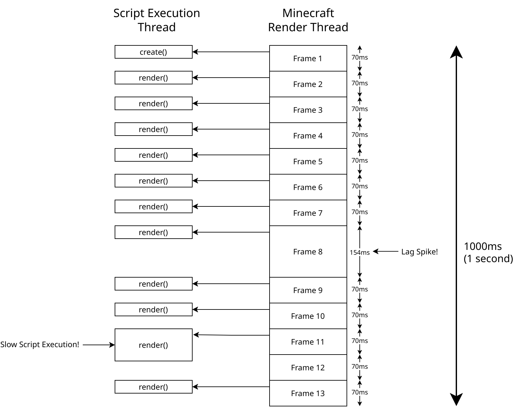

# JCM Scripting

JCM Scripting is a feature introduced in **JCM v2**, which allows the use of JavaScript to control PIDS/Decoration Object/Vehicle rendering and sounds.

This feature is inspired by the [Nemo Transit Expansion](https://modrinth.com/mod/mtr-nte) for MTR 3, and thus also implements a very similar paradigm, as well as backward compatibility functions.

One may consider this as an unofficial continuation for the NTE Scripting Feature.

## Introduction
### What is Scripting in JCM?
Essentially it allows you to use **JavaScript** to insert custom logic into the game, which will be executed and widens the possibilities of the MTR Mod.

JCM Scripting is consisted of different **Script Type**, but what are they?

### Script Type
#### Understand Script Type by Analogy
To better understand **Script Type**, let's imagine the following:

- Script Type = **Booth**
- Scripting Engine = **Venue**
- JCM Scripting = **Exhibiton Event**
- JCM = **Exhibiton Organizer**

Within the exhibition **(JCM Scripting)**, there are multiple booths **(Script Type)**. There are no "one way" to interact with a booth **(Script Type)** as each booth is setup different. However each booth still have a predefined plot size and a specific entrance direction that the visitor expects **(Common function calls)**.

All booths **(Script Type)** may take advantage of the common facilities provided by the venue **(Scripting Engine)** such as air-con & lighting **(Base JavaScript API)**, and anything that an exhibition organizer provides **(Some shared script APIs/Utilities provided by JCM)**.

#### Understand Script Type by Code Example
Here is a snippet of 2 types of script: **Eyecandy Scripting** and **PIDS Scripting**:

=== "Eyecandy Scripting"
    ```js
    const poleModelData = ModelManager.loadRawModel(Resources.id("mtr:example/pole.obj"), true);
    const poleModel = ModelManager.upload(poleModelData);

    function render(ctx, state, blockEyecandy) {
        // Define draw call to submit
        let modelDrawCall = ModelDrawCall.create()
            .modelObject(poleModel)

        // Render pole model
        ctx.getRenderManager().queue(modelDrawCall);
    }
    ```

=== "PIDS Scripting"
    ```js
    function render(ctx, state, pidsBlockEntity) {
        // Render Hello World text to PIDS
        Text.create()
        .text("Hello World!")
        .color(0xFFFFFF)
        .draw(ctx);
    }
    ```

    !!! note
        The **Text** in this instance is only made available for PIDS Scripting, this does not exist in Eyecandy Scripting!

You'll notice that function name (and number of parameters) are the same across script types (The `render` function), however the parameter values passed to them are different (`pidsBlockEntity` vs `blockEyecandy`).

Different types of script can also expose different classes/objects to them (e.g. PIDS Scripting's **Text** class), and they may impose their own design paradigm.

??? info "TLDR (Too long to read :D)"
    JCM Scripting is a foundation to serve different types of scripting. The use case and possibilities of scripts is defined by the different type of scripting available.

### Available Script Types
JCM currently provides 3 (functional) script types out of the box.

If you are looking to *get started* on scripting, check out the script types below to see more details.  
*Otherwise if you would like to learn more about how scripting in JCM works, keep on reading!*

|Type|Description|Provider|
|-|-|-|
|[Vehicle Scripting](./type/vehicle/index.md)|This allows scripts to render 3D models/displays, as well as playing sounds for an MTR vehicle.|MTR (via JCM)|
|[Eyecandy Scripting](./type/eyecandy/index.md)|This allows scripts to render 3D models/displays, as well as playing sounds on an MTR Decoration Object|MTR (via JCM)|
|[PIDS Scripting](./type/pids/index.md)|This allows scripts to draw custom text/texture, as well as playing sounds for a JCM PIDS in the form of a PIDS Preset|JCM|

??? info "Third party Script Types"
    Note that additional script types can be registered by 3rd party mod developers. In that case, they should be responsible for documenting how their specific type of scripting works, and how developers may make use of them. Those won't be covered in this documentation.

### What is JavaScript?
JavaScript is a programming language that... in very simple terms, instructs computer to do stuff :D

It can describe logic, an example would be:  
<u>If</u> there's pineapple on top of the pizza, <u>then</u> remove the pineapple and eat the pizza, <u>otherwise</u> eat the pizza.

This rest of this article assumes that you have a basic understanding of JavaScript and JavaScript types, so it won't delve into the basic syntax and other aspects of it here.

You can learn JavaScript from resources on the web, such as [here](https://javascript.info/).

### The Nature of Scripting in JCM
While JS is commonly associated with web development or even server applications (e.g. Node.js), JCM's implementation usage of JS only utilize the base language itself.

As such, this means that you only really need to care about the syntax (e.g. Variable & Function Declaration, conditional logic) as well as some [Built-in Objects](https://developer.mozilla.org/en-US/docs/Web/JavaScript/Reference/Global_Objects) such as [Date](https://developer.mozilla.org/en-US/docs/Web/JavaScript/Reference/Global_Objects/Date), [Map](https://developer.mozilla.org/en-US/docs/Web/JavaScript/Reference/Global_Objects/Map) etc.

Other stuff such as HTML/CSS/DOM manipulation <u>is not applicable</u> to JCM Scripting.

Keep that in mind, as IDE (Such as Visual Studio Code) may assume you are developing for a webpage and provides suggestions that are not applicable to JCM/NTE scripting!

#### FAQs
??? question "Do I have to learn Java to write JavaScript?"
    JavaScript does not have anything, or not much to do with Java at all, even though they share "Java" in the name.

??? question "But can I use Java in JavaScript?"
    This would not be the case under normal circumstances, as these 2 are different languages.

    *However* the JavaScript Engine that JCM/NTE uses, **Rhino**, is based on Java, and it *does* contain interoperability with java classes/packages via a feature called LiveConnect. In practice it means you can invoke methods like they are JS functions.

### Script Flow

#### Parsing/Loading Stage
When Minecraft reloads it's resource pack (When the game is starting, or an F3+T instantiation/change of resource pack), JCM will parse (executes) your JS script once. This is known as the **Parsing Stage**, in which scripts are evaluated for the first time.

Your script are expected to have functions with specific name (i.e. `create()`, `render()`, `dispose()`).

After your script has been executed once, JCM will capture the above functions internally (if found) to save them for later invocation in the Runtime Stage.

#### Runtime Stage
In the Runtime Stage, JCM will try to invoke the above 3 functions (create, render, dispose) as deemed appropriate. (Usually every frame for `render`, `create` on first render, and `dispose` when script should no longer be executed)

When calling the 3 functions above, 3 parameters will be provided: `ctx, state, wrapper`.

- The `ctx` variable is the Context object, and is used primarily for action (Such as performing rendering). (Different for each script types)
- The `state` variable is a standard JS object which you can put any variable in, and they will be "remembered" for each instance. (e.g. For each vehicle)
- The `wrapper` variable is a read-only object to give you information. For example in **Vehicle Scripting**, the `wrapper` object is a `Vehicle`, which you may query various things such as the current vehicle speed, doors value etc. (Different for each script types)

This means that when you have, say 2 vehicles in view, your `render()` function will be called twice, and the `ctx, state, wrapper` all pertains to different vehicles.

An example demonstrating loading and runtime stage is as follows:

``` js linenums="1"
let displaySpeed = 1; // Loading Stage

function create(ctx, state, train) {
     state.displaySpeed = 0.75; // Runtime Stage
}

function render(ctx, state, train) {
     state.displaySpeed += 1; // Runtime Stage
     print("dp: " + state.displaySpeed); // Runtime Stage
}

function dispose(ctx, state, train) {
}

print(displaySpeed); // Loading Stage
```
An example console output of the above code:
```
1 // Executed in loading stage (Line 15)

/* Join games, vehicle A enters into view */

dp: 1.75 // vehicle A rendering (Line 9)
dp: 2.75 // vehicle A rendering (Line 9)

// Assume vehicle B now enters the view, alongside vehicle A

dp: 3.75 // vehicle A rendering (Line 9)
dp: 1.75 // vehicle B rendering (Line 9)

dp: 4.75 // vehicle A rendering (Line 9)
dp: 2.75 // vehicle B rendering (Line 9)
```

#### Runtime Stage (Flow Illustration)

An example flow is available below. This chart assumes the player is running Minecraft at 13fps (For simplicity sake), which means 13 frames in 1 second.



Immediately you may have noticed the following thing:

#### Scripts are executed asynchronously
This means that the script runs in the background and does not prevent the game from continue rendering (Therefore, less fps lag).

In the runtime stage, scripts are executed with a total of 4 threads, see [Multithreaded Runtime Execution](./features/threaded_execution.md) for detals.

!!! warning
     This does not mean you can freely block script execution or run some `Thread.Sleep`, as you would then be blocking the script execution thread, making others (and your) script run slower!

#### Scripts are executed every frame
More precisely, the `render()` function is executed every frame.

If there's a lag spike (Seen in **Frame 8**), your script would be not be called until the next frame came around, which is 154ms later in the above example.

As such, you should not assume that your function will always be called "x times per second", or "xx ms after the last one".

This also means that if you increment a variable by a fixed amount for each frame, that increment speed won't be the same if the fps is higher/lower.

[Delta timing](https://en.wikipedia.org/wiki/Delta_timing) is used to solve this by obtaining the time since last frame, which can then be used to balance out the value.

#### Except they aren't always executed every frame!
While JCM *tries* to call the `render()` function for every frame, it is only made on a best-effort basis. If your script has not finished executing before the next frame came around, then your function won't be called again until it has finished execution.

## Script Errors

!!! note inline end
     Script errors in the **Parsing/Loading Stage** are not currently displayed within the game (Like NTE had with debug mode), you need to check for errors in the game log, usually accessible by your launcher

If the script is executed incorrectly in the **Runtime Stage**, an error will be reported in the Minecraft log (Starting with `[Scripting] Error executing script!`).

You can visualize the error on your HUD screen by enabling the [Script Debug Overlay](./aids/script_debug_overlay.md).

The error message will indicate which line of code in which script file the error occurred. Most launchers have the ability to display logs in a separate window in real time.

The script execution engine will then pause the entire script for 4 seconds before trying to execute the function again.

## How to read this document

On the sidebar to your left, you will see **API Reference**, which documents all the classes/functions/fields you can access in the script.

For each API reference page, it usually contains references to functions/fields you can access on a specific class, the notation is described below in the form of different examples.

### Example 1

```js
static Resources.id(idStr: String): Identifier
```

- `static` means that you don't need to create an object to use this function, you can call `Resources.id("aaa:bbb")` directly.
- `idStr: String` means that the `idStr` parameter accepts a java **String** type. (Note: JS string are converted to Java String, thus you don't need to do the conversion yourself. See [Interoperability between Java Classes/Methods](./articles/tips.md#interoperability-between-java-classesmethods) for details.)
- `: Identifier` means that a function call will return a value of type `Identifier`.

### Example 2
```js
DataReader.asString(): String?
```

- The lack of `static` means that an **instance** of the object is required to execute the function. In the above example, you need to obtain an instance of `DataReader` (Usually through return values from functions like [Resources.read](./resources.md#resources)). For example, if `a` is an object of DataReader type, then the function can be called as `a.asString()`.
- `()` means that this is a function with no parameters, you can just invoke it.
- `: String?` means that it will return a java **String**. The `?` denotes that the value is nullable, and it is possible for the function to return **null**.
    - In typescript notation (With Java type), this would be `: String | null`.

**Example Usage:**
```js
let dr = Resources.read(Resources.idr("a.bin")); // Obtain a DataReader instance by reading a resource from resource pack
let decodedString = dr.asString(); // Invoke DataReader.asString()

// String? indicates it is nullable. The reason for null is usually documented in the reference table.
if(decodedString != null) { // In this case, it will return null if a.bin cannot be decoded as a plain text file.
    print(decodedString);
}
```

### Example 3
```js
static Files.saveData(content: BufferedImage, path: String...): void
```

- `static` means that you don't need to create an object to use this function, you can call `Files.saveData` directly in your script.
- `content: BufferedImage` means that the parameter accepts a BufferedImage, which is a Java type. See [Interoperability between Java Classes/Methods](./articles/tips.md#interoperability-between-java-classesmethods) for details.
- `path: String...` means that from now on, you may pass as much parameter as you like, as long as they are all `String`. It's like passing an array of `String`, but you pass the `String` directly as the function parameter.
- `: void` means that the function has no return value.

**Example Usage:**
```js
Files.saveData(bufferedImage, "script_data_a", "cache", "test.png");
```