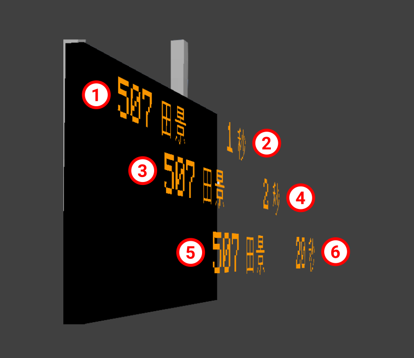

# JCM PIDS Scripting
PIDS Scripting allows you to use [JavaScript](../../index.md) to control [Scripted PIDS Preset](../../../pids/scripted/index.md) contents.

!!! note "Important note!"
    There have been multiple attempts regarding PIDS Customization with the MTR Mod.  
    This system is **not compatible** with any of the following:

    - PIDS Layout Editor / PIDS Modularization / PIDS JSON by EpicPuppy
    - PIDS text customization seen in early betas of MTR 4.

    You are **not able** to import any data from the above to this system, and the way it works is fundamentally different.  
    Therefore, this can be seen as a replacement to the above systems which supports the latest/official MTR mod releases, but not a drop-in replacement. The barrier to entry is higher, though it also means that more complex PIDS displays can benefit from this.

## Concept

### Draw/Rendering
JCM PIDS Scripting allows you to draw either a **Text** or **Texture** onto the Minecraft World.

**When drawn, they are just regular polygons rendered onto the Minecraft World rather than being a 2D plane with a texture. Therefore it is possible for elements to overflow beyond the PIDS screen, and it is the developer responsibility to ensure such events should not happen.**

If you absolutely require sophisticated image processing/clipping, you may [follow this section](#using-awt-graphicsdynamic-textures) to draw and manipulate a texture and draw it onto a 2D Plane. However it may result in slightly slower performance/higher memory usage.

#### Draw Layer/Order
The draw order/z-index is depicted by the order the image is drawn in. Whichever elements gets drawn later, whichever element goes in-front. See the image below: (z-differences is exaggerated for demonstration purposes)

{ width="500" }

The number in the circle depicts the order in which the element is drawn in. 1 gets drawn first, then 2, 3, 4, 5 and finally 6.

As such, element 6 is the frontmost element, which can cover element 1-5 if overlapped.

## Implementation

### Script Registration
A preset is automatically considered as a Scripted PIDS Preset by specifying either `scriptFiles` **or** `scriptTexts` property in `joban_custom_resources.json`:

``` json
{
  "pids_images": [
    {
      "id": "pids_tut",
      "name": "JS Tutorial Preset",
      "scriptTexts": ["print('Goodbye World');"],
      "scriptFiles": ["jsblock:scripts/pids_tut.js"]
    }
  ]
}
```

`scriptFiles` points to the list of script file to load.

`scriptTexts` allows you to directly write JS inside, but should only be used for simple variable declaration.

*Note: At the moment, mixing Scripted PIDS Preset and JSON PIDS Preset is not possible.*

### Called Functions
Your script can include the following functions that JCM will call as needed:
``` js
function create(ctx, state, pids) { ... }
function render(ctx, state, pids) { ... }
function dispose(ctx, state, pids) { ... }
```

|Functions|Description|
|:--------|:----------|
|`create`|It is called when a PIDS is rendered for the first time and can be used to perform some initialization operations, for example, to create dynamic textures.|
|`render` |This function is called at-most once per frame. It is used to draw contents onto the PIDS. In practice however, the code is executed in a separate thread so as not to slow down FPS. If it takes too long to execute the code, it may be called once every few frames instead of every frame.|
|`dispose`|Called when a PIDS Block goes out of sight. Can be used for things like releasing the dynamic textures to free up memory.|

JCM calls these functions with three parameters, each of which is described below.

|Parameter|Description|
|:--------|:----------|
|First (`ctx`)|Used to pass rendering actions to JCM. Type — PIDSScriptContext.|
|Second (`state`)|A JavaScript object associated with a single PIDS Block.<br>The initial value is {}, and its content can be set arbitrarily to store what should be different for each PIDS Block.|
|Third (`pids`)|Used to get the status of pids and arrivals. Type — [PIDSBlockEntity](#pidsblockentity)|

The following lists all the rendering control operations that can be performed and all the information that can be obtained about PIDS.

### API Reference

#### Check JCM Version
You can obtain JCM version by using `Resources.getAddonVersion("jcm")`.  
This would return a string formatted like: `2.0.0-beta.5`

#### Rendering Related

##### PIDSScriptContext
|Functions And Objects|Description|
|:--------------------|:----------|
|`PIDSScriptContext.getRenderManager(): RenderManager`|Obtain a [RenderManager](../../rendering.md#rendermanager) instance, which can be used to render stuff onto the Minecraft World.<br>The base position are set to the block's position.|
|`PIDSScriptContext.getSoundManager(): SoundManager`|Obtain a [SoundManager](../../sounds.md) instance, which can be used to play sound onto the Minecraft World.<br>The base position are set to the block's position.|
|`PIDSScriptContext.setAutoZOrdering(autoZOrdering: boolean): void`|To ensure z-fighting don't occur, by default JCM will translate a small amount (step) in the z-direction everytime you draw a text/texture. You can turn this behaviour off by setting autoZOrdering to false, then you can use `Text/Texture#zOrder(order: int)` to control the z-order manually|
|`PIDSScriptContext.setZOrderStep(distanceMeter: double): void`|To ensure z-fighting don't occur, by default JCM will translate a small amount (step) in the z-direction everytime you draw a text/texture. Here you can pass in a custom step value. By default this is `0.0002`|
|`PIDSScriptContext.setDebugInfo(key: String, value: object): void`|Output debugging information in the upper left corner of the screen. You need to enable **[Script Debug Overlay](../../aids/script_debug_overlay.md)** in JCM Settings to display it.<br>`key` is the name of the value<br>`value` is the content (`value` will be converted to string for display, except for GraphicsTexture which will display the entire texture image on the screen).|

##### Text
|Functions And Objects|Description|
|:--------------------|:----------|
|`Text.create(): Text`<br>`Text.create(comment: String): Text`|Create a new text object|
|`Text.pos(x: double, y: double): Text`|Set the X and Y position of the element|
|`Text.size(w: double, h: double): Text`|Set the width and height of the element<br>(Used in conjunction with `Text.stretchXY()` and `Text.scaleXY()`)|
|`Text.text(str: String): Text`|Set the text content to str|
|`Text.scale(i: double): Text`|Set the text's scale to i. Defaults to `1`<br>Note: This scales the whole text component, you should divide your scale when specifying `.size()` for instance.|
|`Text.leftAlign(): Text`|Align the text to the left (Default)|
|`Text.centerAlign(): Text`|Align the text to the center|
|`Text.rightAlign(): Text`|Align the text to the right|
|`Text.shadowed(): Text`|Add shadow to the drawn text|
|`Text.italic(): Text`|Set the text style to Italic|
|`Text.bold(): Text`|Set the text style to Bold|
|`Text.stretchXY(): Text`|Text Overflow Mechanism:<br>When text overflowed beyond it's size, stretch the text on the overflowing axis to fit|
|`Text.scaleXY(): Text`|Text Overflow Mechanism:<br>When the text overflowed beyond it's size, stretch the text on both axis to fit<br>(Keep aspect ratio)|
|`Text.wrapText(): Text`|Text Overflow Mechanism:<br>When the text overflowed beyond it's size, split the text into the next line without any scaling.|
|`Text.marquee(): Text`|Text Overflow Mechanism:<br>When the text overflowed beyond it's size, draw a portion of the text at a time with scrolling animation|
|`Text.marquee(duration: double): Text`|Same as above, but enforce how long a marquee cycle takes. (In Minecraft Tick)|
|`Text.withMarqueeProgress(progress: double): Text`|A value from 0.0 - 1.0, allowing you to override/control the marquee sliding progress directly.|
|`Text.fontMC(): Text`|Use vanilla Minecraft's font|
|`Text.matrices(matrices: Matrices): Text`|Apply a [matrices](../../math.md#matrices) to the current text object|
|`Text.font(id: String): Text`<br>`Text.font(id: Identifier): Text`|Set the font by it's ID. Defaults to `mtr:mtr`<br>The font should be loaded in Minecraft via the font json format.<br>This does not have any effect if **Use Custom MTR Font** is disabled in MTR mod's Config.|
|`Text.color(color: int): Text`|Set the text color, in RGB format.|
|`Text.draw(ctx: PIDSScriptContext): void`|Mark the text as something that should be rendered to the PIDS.|
|`Text.zOrder(order: int): Text`|Specify the z-order manually.|

##### Texture
|Functions And Objects|Description|
|:--------------------|:----------|
|`Texture.create(): Texture`<br>`Texture.create(comment: String): Texture`|Create a new texture object|
|`Texture.pos(x: double, y: double): Texture`|Set the X and Y position of the element|
|`Texture.size(w: double, h: double): Texture`|Set the width and height of the element|
|`Texture.texture(id: String): Texture`<br>`Texture.texture(id: Identifier): Texture`|Set the texture ID to draw.<br>Note that the texture ID should point to a PNG file or an .mcmeta file.|
|`Texture.color(color: int): Texture`|Set the text color, in RGB format.|
|`Texture.uv(u2: float, v2: float): Texture`<br>`Texture.uv(u1: float, v1: float, u2: float, v2: float): Texture`|Set the UV coordinates|
|`Texture.matrices(matrices: Matrices): Texture`|Apply a [matrices](../../math.md#matrices) to the current texture object|
|`Texture.draw(ctx: PIDSScriptContext): void`|Mark the texture as something that should be rendered to the PIDS.|
|`Texture.zOrder(order: int): Texture`|Specify the z-order manually.|

#### PIDS Object Related

##### PIDSBlockEntity
|Functions And Objects|Description|
|:--------------------|:----------|
|`PIDSBlockEntity.type: String`|Return the type of PIDS used, possible value are:<br>- rv_pids<br>- rv_pids_sil_1<br>- rv_pids_sil_2<br>- lcd_pids<br>- pids_projector<br>- pids_1a|
|`PIDSBlockEntity.width: int`|The full width of the available PIDS screen area.|
|`PIDSBlockEntity.height: int`|The full height of the available PIDS screen area.|
|`PIDSBlockEntity.rows: int`|The number of arrival rows supported by the PIDS Block|
|`PIDSBlockEntity.isRowHidden(i: int): boolean`|Returns whether the arrival for that row is hidden. (via PIDS Config)|
|`PIDSBlockEntity.getCustomMessage(i: int): String`|Returns the custom message configured for that row via PIDS Config.<br>Empty string (`""`) if not set.|
|`PIDSBlockEntity.isPlatformNumberHidden(): boolean`|Returns whether the platform number is set to hidden. (via PIDS Config)|
|`PIDSBlockEntity.blockPos(): Vector3f`|Returns the coordinate of which the PIDS block is located.|
|`PIDSBlockEntity.isKeyBlock(): boolean`|Returns whether the current block is a unique block within a PIDS pair<br>(e.g. Identify 1 side of a dual-sided PIDS)|
|`PIDSBlockEntity.station(): Station?`|Returns the station area that this PIDS is in.<br>Null if not in any station, or the client is not aware of the station.|
|`PIDSBlockEntity.arrivals(): ArrivalEntries`|Returns the arrivals obtained for the PIDS.|

##### ArrivalEntries
|Functions And Objects|Description|
|:--------------------|:----------|
|`ArrivalEntries.get(i: int): ArrivalEntry?`|Returns the i<sup>th</sup> arrival entry.<br>Null if there's no i<sup>th</sup> arrival entry or no arrival information.<br>**Note that only up to 10 arrivals is fetched per platform, see this [issue](https://github.com/DistrictOfJoban/Joban-Client-Mod/issues/40) for details.**|
|`ArrivalEntries.mixedCarLength(): boolean`|Returns whether the list of arrivals have arrival entry with different cars.|
|`ArrivalEntries.platforms(): List<Platform>`|Returns the platforms that all arrival entry is stopping at.|

##### ArrivalEntry
Represent a single arrival entry.

|Functions And Objects|Description|
|:--------------------|:----------|
|`ArrivalEntry.destination(): String`|Returns the destination name of the arrival entry.<br>(Usually the destination's station, or a custom destination string)|
|`ArrivalEntry.arrivalTime(): long`|Returns the epoch time (in Millisecond) the vehicle will arrive at.<br>Use `new Date(value: number)`to obtain a JS Date object of the arrival time.|
|`ArrivalEntry.departureTime(): long`|Returns the epoch time (in Millisecond) the vehicle will depart at.<br>Use `new Date(value: number)`to obtain a JS Date object of the departure time.|
|`ArrivalEntry.deviation(): long`|Returns the deviation[?]|
|`ArrivalEntry.realtime(): boolean`|Returns whether the arrival entry is scheduled (i.e. Vehicle not departed), or a real-time estimation (i.e. Vehicle running)|
|`ArrivalEntry.departureIndex(): long`|Returns the departure index[?]|
|`ArrivalEntry.terminating(): boolean`|Returns whether the arrival entry will terminate its service at the current platform.|
|`ArrivalEntry.route(): SimplifiedRoute?`|Returns the [SimplifiedRoute](../../tsc.md#simplifiedroute) object that the vehicle is running on.<br>Returns null if the route cannot be found (e.g. Hidden/Deleted/Not fetched)|
|`ArrivalEntry.routeId(): long`|Returns the id of the route that the vehicle is running on when arrived.|
|`ArrivalEntry.routeName(): String`|Returns the name of the route that the vehicle is running on when arrived.|
|`ArrivalEntry.routeNumber(): String`|Returns the route number string (Previously called LRT Route Number), empty string if route number is not set.|
|`ArrivalEntry.routeColor(): int`|Returns the color of the route that the vehicle is running on when arrived.|
|`ArrivalEntry.circularState(): Route.CircularState`|Returns the [circular state](../../tsc.md#routecircularstate) of the route that the vehicle is running on.|
|`ArrivalEntry.platform(): Platform?`|Returns the [Platform](../../tsc.md#platform) object that the vehicle will approach at the monitored platform.<br>Returns null if the platform cannot be found (e.g. Hidden/Deleted/Not fetched)|
|`ArrivalEntry.platformId(): long`|Returns the id of the platform that the vehicle will approach at.|
|`ArrivalEntry.platformName(): String`|Returns the name of the platform that the vehicle will approach at.|
|`ArrivalEntry.carCount(): int`|Returns the number of cars the vehicle has.|
|`ArrivalEntry.cars(): List<CarDetails>`|Returns a List containing [CarDetails](#cardetails) for each car.|

#### Transport Simulation Core Related
Transport Simulation Core (TSC) is the backend serving MTR 4. Below are some of the classes in TSC, which may be returned by JCM above.

##### CarDetails
|Functions And Objects|Description|
|:--------------------|:----------|
|`CarDetails.getVehicleId(): String`|Returns the id of the vehicle car (As defined in Resource Packs)|

### Using AWT Graphics/Dynamic Textures
While not a regular tested use case for PIDS, you can create a [Dynamic Textures](../../dynamic_textures.md) and draw it onto a PIDS:

``` js
importPackage(java.awt);

function create(ctx, state, pids) {
    state.tex = new GraphicsTexture(pids.width, pids.height);
}

function render(ctx, state, pids) {
    let g = state.tex.graphics;
    g.setColor(Color.RED);
    g.fillRect(0, 0, pids.width, pids.height);
    g.setColor(Color.GREEN);
    g.fillRect(0, 0, Math.abs(Math.sin(Timing.elapsed())) * pids.width, pids.height);
    
    state.tex.upload();
    
    Texture.create("Dynamic Texture")
    .texture(state.tex.identifier)
    .size(pids.width, pids.height)
    .draw(ctx);
}

function dispose(ctx, state, pids) {
    state.tex.close();
}
```