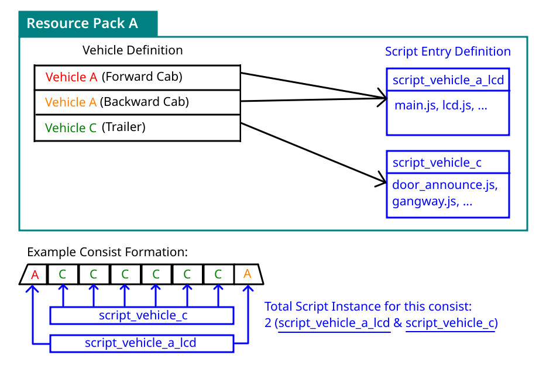

# Vehicle Scripting

Vehicle Scripting allows you to use [JavaScript](../../index.md) to control vehicle rendering and playing sounds (Such as playing on-board announcements).

## Concept
In MTR 4, Resource Pack is able to define a custom vehicle (In the context of railway & trains, it is the equivalent of a single **carriage**). These vehicles/carriages can be freely arranged in-game via the Siding options, which would make up a **Vehicle Consists**.

(For MTR 3 resource packs, a train entry is broken up into Forward Cab, Trailer, Backward Cab and Double Cab variant.)

### The question: What should a vehicle script be bound to?

Per-carriage, per-consist? Or how about just a **Script Entry**:



A **Script Entry** is a separate object that exists just like vehicle, and vehicle entries in resource packs can reference a Script Entry by it's id. (In which, a Script Entry can be re-used by multiple vehicles.)

This effectively allows mixed carriage operation, while minimizing the number of script instances (Which could hinder performance), as well as providing backward compatibility with NTE scripts, which previously expected a script to be tied to an entire train consist.


### :material-refresh: Data Obtaining & Fetching
**Under MTR 4**, only nearby stations/routes are sent to the client in order to conserve data usage. This means that if, let's say you join in the middle between 2 stations (And you are nowhere close to either of them), the client would not be aware of any existence of routes nor stations.  
<sub>*Side note: This is also part of the reason why the route filter in sensor blocks may not show any routes.*</sub>

This presents a problem for script developers:  
To compose something moderately complex such as an on-board LCD route map, they need the route and station reference, as well as the full list of stops the vehicle is going to make. This "nearby-data fetching" concept would pose marginal limitations to these scripts.

To solve this, JCM introduced it's own data fetching mechanism that is separate from MTR.  
Under this mechanism, scripts can:

1. Request for all the stops the vehicle is going to make (Stopping point distance, and all the station/route ids).
2. After that, request the Station/Route object that appears in the stops data (Based on the ID) from the server.
3. Finally, scripts can enjoy a full reference to the stops, routes & stations the vehicle is running.

Note that this is not a perfect solution for complex scripts which may need a full copy of the Station/Route reference, but it does solve the common "lack of data" issue for most scripts.

JCM divides the data fetching into 3 different mode, which are described more in detail in the **Implementation** section.

## Implementation
### Script Registration

=== "MTR 4 Custom Resources"
    You can define your script entry in the `vehicleScripts` array, and reference it with `scriptId` within your vehicle object:

    ``` json linenums="1" hl_lines="7 10-19" title="mtr_custom_resources.json"
    {
        "vehicles": [
            {
                "id": "cst_sp1900_cab_1",
                "name": "Modified SP1900 (Cab, Forward)",
                // ...
                "scriptId": "cst_sp1900_lcd"
            }
        ],
        "vehicleScripts": [
            {
                "id": "cst_sp1900_lcd",
                "prependExpressions": ["print('Hello world')"],
                "scriptLocations": ["mtr:my_pack/js/sp1900_lcd/main.js"],
                "input": {
                    "yearEra": 2004
                }
            }
        ]
    }
    ```

    Field description within the script entry (entries within `vehicleScripts`) block are listed as follows:

    |Field name|Description|Equivalence in MTR 3/NTE format|
    |----------|-------|--------------------|
    |scriptLocations|An array containing the locations of .js scripts, multiple scripts can be specified.|scriptFiles|
    |prependExpressions|Allows you to directly write JS inside, which will be executed before the scripts in **scriptLocations**|scriptTexts|
    |input|Allows you to specify arbitary JSON object. which is then made accessible to the **.js** scripts via the variable `SCRIPT_INPUT`|scriptInput|

    All fields are optional and could be omitted. However in order for script to load, either the `scriptLocation` or `prependExpressions` should be filled.

=== "MTR 3 / NTE Format"
    The registration is same as NTE.

    ``` json linenums="1" hl_lines="6-10" title="mtr_custom_resources.json"
    {
        "custom_trains": {
            "cst_sp1900": {
                "name": "Modified SP1900",
                // ...
                "script_texts": ["print('Hello World!')"],
                "script_files": ["mtr:my_pack/js/sp1900_lcd/main.js"],
                "script_input": {
                    "yearEra": 2004
                }
            }
        },
        "custom_signs": {
            // ...
        }
    }
    ```

    - `script_files` is an array containing the locations of .js scripts. Multiple scripts can be specified.
    - `script_texts` allows you to directly write JS inside, and are executed before the scripts in **scriptFiles**.
    - `script_input` allows you to specify arbitary JSON object. This is then made accessible to the **.js** scripts via the variable `SCRIPT_INPUT`.

    All script fields are optional and could be omitted. However in order for script to load, either the `script_files` or `script_texts` should be filled.

### Called Functions
Your script can include the following functions that JCM will call as needed:
``` js
function create(ctx, state, vehicle) { ... }
function render(ctx, state, vehicle) { ... }
function dispose(ctx, state, vehicle) { ... }
```

|Functions|Description|
|:--------|:----------|
|`create`|It is called when a Decoration Object block is rendered for the first time and can be used to perform some initialization operations, for example, to create dynamic textures. (via the [Graphics API](../../dynamic_textures.md))|
|`render` |This function is called at-most once per frame. It is used to render contents. In practice however, the code is executed in a separate thread so as not to slow down FPS. If it takes too long to execute the code, it may be called once every few frames instead of every frame.|
|`dispose`|Called when the vehicle goes out of sight. Can be used for things like releasing the dynamic textures to free up memory.|

*Note: Any of the above functions are optional and may be omitted if you don't find it useful for your script.*

The parameters (`ctx, state, vehicle`) are described below:

|Parameter|Description|
|:--------|:----------|
|First (`ctx`)|Used to pass rendering actions to JCM. Type — [VehicleScriptContext](#vehiclescriptcontext).|
|Second (`state`)|A JavaScript object associated with a vehicle.<br>The initial value is {}, and its content can be set arbitrarily to store what should be different for each block.|
|Third (`vehicle`)|This returns the vehicle object representing the current vehicle consist. Type — [Vehicle](#vehicle)|

### Implementing Data Fetching
For the most part, JCM tries to handle data obtaining / fetching as transparently as possible.  
For developers, you only need to know the following 3 different data fetching mode that are employed:

- **SKIP** - Default for MTR 4 scripts, it skips the data fetching process. Stops data are compiled locally in a best-effort attempt, but there's no guarentee any data would be complete or exists. Suitable for simple scripts that does not require stops reference. (e.g. Sounding a chime when the vehicle starts moving, you only need to compare the vehicle's speed.)
- **ALL** - This requests JCM to a) fetch the stops data, and b) fetch the MTR data (Station/Route etc.) based on the stops data. Before the stops data is retrieved (which takes time over the network), it performs identically to **SKIP**.<br>Note that even after the stop data is retrieved, `Stop.station` and `Stop.route` may still return null, since the MTR data may not be fetched yet. You should add appropriate null checks to avoid error.
- **MANDATORY** - Under this mode, stops data are requested just like **ALL**. However JCM will not execute the script until both the stop data and MTR data are retrieved.<br>This is the default for scripts in the MTR 3 registration format, since these scripts previously expects data to be immediately available and therefore may not tolerate any null value.

#### Configuring Data Fetching mode

You can use `VehicleScriptContext.setDataFetchMode(mode: String)` to configure the data fetching mode. See more details in the **API Reference** section.

Note that it is not possible for scripts registered in the MTR 3 format to configure this, since it defaults to the **MANDATORY** mode, and thus the `create()` function is not executed before the data fetching has already been done.

### API Reference

#### VehicleScriptContext
This is the `ctx` parameter passed to the create/render/dispose functions.

Script may invoke one of the following methods to check the script's status (Such as which car index it is associated with), control rendering and sounds, change the data fetch mode, set debug info overlay.

|Functions And Objects|Description|
|:--------------------|:----------|
|`VehicleScriptContext.getCarRenderManager(carIndex: int): RenderManager?`|Obtain a [RenderManager](../../rendering.md#rendermanager) for rendering onto the Minecraft World.<br>Base transformation is set to the center of the car `carIndex`, with the Y-position being set to **1m** above the bottom of the vehicle.<br>Returns null if the `carIndex` is not associated with the current script entry.|
|`VehicleScriptContext.getCarBogieRenderManager(carIndex: int, bogieIndex: int): RenderManager?`|Obtain a [RenderManager](../../rendering.md#rendermanager) for rendering onto the Minecraft World.<br>Transformation is relative to the bogie `bogieIndex` for car `carIndex`.<br>`bogieIndex` is either **0** or **1** for the forward and backward bogie. (**0** if the car only contains a single bogie)<br>Returns null if the `carIndex` is not associated with the current script entry, or there's no bogie for `bogieIndex`.|
|`VehicleScriptContext.getCarSoundManager(carIndex: int): SoundManager?`|Obtain a [SoundManager](../../sounds.md) instance, which can be used to play sound onto the Minecraft World.<br>The base position are set to the center position of the car `carIndex`.<br>Returns null if the `carIndex` is not associated with the current script entry.|
|`VehicleScriptContext.getScriptEntryId(): String`|Obtain the script entry id.|
|`VehicleScriptContext.getMyCars(): int[]`|Obtain an array of car indexes which is associated with this script entry.|
|`VehicleScriptContext.setDataFetchMode(mode: String): void`|Set the [Data Fetch Mode](#implementing-data-fetching) for the current script entry, one of "SKIP", "ALL" or "MANDATORY".|
|`VehicleScriptContext.setDebugInfo(key: String, value: object): void`|Output debugging information in the upper left corner of the screen. You need to enable **[Script Debug Overlay](../../aids/script_debug_overlay.md)** in JCM Settings to display it.<br>`key` is the name of the value<br>`value` is the content (`value` will be converted to string for display, except for GraphicsTexture which will display the entire texture image on the screen).|

??? info "Show deprecated fields/functions"
    These are the functions implemented in JCM for backward compatibility with scripts made for MTR-NTE.  
    Newer scripts should not utilize these functions anymore.

    |Functions And Objects|Description|
    |:--------------------|:----------|
    |`VehicleScriptContext.drawCarModel(model: Model, carIndex: int, matrices: Matrices?): void`|Requests a [Model](../../model.md#model-aka-modelcluster) loaded via [ModelManager](../../model.md#modelmanager) to be drawn.<br>`carIndex` is the car number which the model should be rendered in. If the script does not belong to the car in `carIndex`, this function will do nothing.<br>`matrices` is the transformation of model placement. If null, the model will be placed in the center of the car without transformation.<br>Replaced by [RenderManager](../../rendering.md#rendermanager)'s `drawModel()` via `getCarRenderManager()`|
    |`VehicleScriptContext.playCarSound(sound: Identifier, carIndex: int, x: float, y: float, z: float, volume: float, pitch: float): void`|Requests a sound specified by the [Identifier](../../resources.md#identifier-aka-resourcelocation) to be played in the world.<br>`carIndex` is the car number which the sound should play in. If the script does not belong to the car in `carIndex`, this function will do nothing.<br>`x`, `y` and `z` is the offset of the sound position, relative to the car's center.<br>`volume` and `pitch` represents the volume and pitch of the sound, `1.0` is the base value.<br><br>Replaced by [SoundManager](../../sounds.md#soundmanager)'s `playSound()` via `getCarSoundManager()`|
    |`VehicleScriptContext.playAnnSound(sound: Identifier, carIndex: int, x: float, y: float, z: float, volume: float, pitch: float): void`|Requests a sound specified by the [Identifier](../../resources.md#identifier-aka-resourcelocation) to be played in the game (Non-positional, only if player is boarded).<br>This is useful for playing on-board announcements.<br>Arguments are same as those of `playCarSound`.<br><br>Replaced by [SoundManager](../../sounds.md#soundmanager)'s' `playLocalSound()` via `getCarSoundManager()`|

??? warning "Show unimplemented functions"
    The following functions are not yet carried over from NTE. However it is expected these functions have relatively low usage and provides limited impact for compatibility.  
    To prove otherwise, submit a new GitHub issue in regard to this, or talk with us in our Discord!

    |Functions And Objects|Description|
    |:--------------------|:----------|
    |`VehicleScriptContext.drawConnModel(model: Model, carIndex: int, matrices: Matrices?): void`|Requests a [Model](../../model.md#model-aka-modelcluster) loaded via [ModelManager](../../model.md#modelmanager) to be drawn as a connector between 2 cars.<br>`carIndex` is the car number which the model should be rendered in. If the script does not belong to the car in `carIndex`, this function will do nothing.<br>`matrices` is the transformation of model placement. If null, the model will be placed in the middle of the 2 car without transformation, and 1m of elevation.|
    |`VehicleScriptContext.drawConnStretchTexture(texture: Identifier, carIndex: int): void`|Draw the same stretching car connection model as MTR, with a custom texture specified by [Identifier](../../resources.md#identifier-aka-resourcelocation).|

#### Vehicle
Represents a vehicle / trainset / train consist.

|Functions And Objects|Description|
|:--------------------|:----------|
|`Vehicle.getStops(): List<Stop>`|Get a list of [Stop](#stop) the vehicle will make, across all routes.|
|`Vehicle.getThisRouteStops(): List<Stop>`|Get a list of [Stop](#stop) the vehicle will make for the current running route.|
|`Vehicle.getNextRouteStops(): List<Stop>`|Get a list of [Stop](#stop) the vehicle will make for the upcoming route.|
|`Vehicle.getNextStopIndex(stopList: List<Stop>, overrunTolerance: double = 0.5): int`|Get the index of the next stop within a `stopList`. (Can be obtained above).<br>`overrunTolerance` is the tolerance in meters in which the next stop will still be counted as the previous stop, even after overruning the stop mark.<br>Returns `stopList.size()` if vehicle already passed all stops in the given `stopList`.|
|`Vehicle.isStopsDataFetched(): boolean`| Whether the stop data is fetched from the server (Instead of being compiled locally).<br>i.e. Always false if data fetch mode is set to `SKIP`.|
|`Vehicle.isRendered(): boolean`|Returns whether any car is being rendered. (i.e. Not being culled by MTR)|
|`Vehicle.isCarRendered(cars: int...): boolean`|Returns whether any of the given car index is being rendered.|
|`Vehicle.isClientPlayerRiding(): boolean`|Returns whether the client player is riding (onboard) the current vehicle.|
|`Vehicle.getMtrVehicle(): VehicleExtension`|Returns the underlying MTR VehicleExtension, which extends [Vehicle](../../tsc.md#vehicle).|
|`Vehicle.getId(): long`|Returns a unique id representing this vehicle.|
|`Vehicle.getSiding(): Siding?`|Returns the [Siding](../../tsc.md#siding) that this vehicle belongs to.<br>Returns null if client does not have reference to the Siding, or data fetching is in progress.|
|`Vehicle.getVehicleId(carIndex: int): String?`|Returns the Vehicle Resource ID as defined in the resource pack for the given `carIndex`.<br>Null if `carIndex` is beyond the car-length of this vehicle.|
|`Vehicle.getLength(carIndex: int): double`|Returns the length (in meters) of the car `carIndex`.|
|`Vehicle.getWidth(carIndex: int): double`|Returns the width (in meters) of the car `carIndex`.|
|`Vehicle.getTransportMode(): TransportMode`|Returns the [TransportMode](../../tsc.md#transportmode) of the current vehicle.|
|`Vehicle.getCarCount(): int`|Returns the number of cars this vehicle has.|
|`Vehicle.getServiceAcceleration(): double`|Returns the acceleration value configured in the siding, and used when the vehicle is in 100% acceleration rate.<br>Unit is `m/millis^2` (Multiply by 1000^2 for m/s^2)|
|`Vehicle.getServiceDeceleration(): double`|Returns the deceleration value configured in the siding, and used when the vehicle is in 100% deceleration rate.<br>Unit is `m/millis^2` (Multiply by 1000^2 for m/s^2)|
|`Vehicle.getMaxManualSpeed(): double`|Returns the maximum allowed manual speed for this vehicle.<br>Unit is `m/millis`. (Multiply by 1000 for m/s)|
|`Vehicle.isManualAllowed(): boolean`|Returns whether manual driving is enabled for this vehicle.|
|`Vehicle.getManualToAutomaticTime(): int`|Returns the time required for the vehicle to automatically switch to automatic operation (ATO), when no one is driving.<br>Unit is in `millisecond`. (Multiply by 1000 for second)|
|`Vehicle.getPathData(): List<PathData>`|Returns the [PathData](../../tsc.md#pathdata) for this vehicle.<br>Note: Due to MTR 4's data syncing mechanism, only a portion of the full PathData will be returned, instead of the full route.|
|`Vehicle.getRailProgress(carIndex: int = 0): int`|Returns the distance in meters the vehicle has travelled since departing from the siding.<br>Supplying a `carIndex` would offset the progress by the car length.|
|`Vehicle.getRailIndex(railProgress: double, roundDown: boolean): int`|Returns the index of PathData given a `railProgress`.<br>`roundDown` will return the previous path index if vehicle is stopped exactly on a node.|
|`Vehicle.getRailSpeed(pathIndex: int): double`|Returns the speed of a section given a `pathIndex` (via `getRailIndex`).<br>Unit is in `km/h`.|
|`Vehicle.getNotchLevel(): int`|Returns the manual driving notch for the current vehicle.<br>Positive number indicates acceleration, negative number indicates deceleration.<br>In MTR 4, the range is between **-5** and **5** for normal operation.<br>Values up to **-7** and **7** is possible, representing 140% of the service acceleration/deceleration.<br>Values up to **-8** is possible, representing emergency brake (EM).|
|`Vehicle.getNotchPosition(): double`|Returns the manual driving notch in the form of a relative percentage, irrespective of the number of notch available.<br>Positive number indicates acceleration, negative number indicates deceleration.<br>Normal operation would return between **-1** and **1**.<br>Values higher than 1 is possible as MTR 4 allows up to 140% of acceleration/deceleration rate, as well as emergency brake.|
|`Vehicle.getDepartureIndex(): long`|Returns the departure index of the vehicle.<br>TODO: Is it relative to depot schedule or the assigned siding schedule?|
|`Vehicle.getSpeedMs(): double`|Returns the current vehicle speed in m/s.|
|`Vehicle.getSpeedKmh(): double`|Returns the current vehicle speed in km/h.|
|`Vehicle.getDoorValue(): double`|Returns a value between 0.0 (Closed) and 1.0 (Opened) representing the door value.<br>This does not account for the actual door opening position, which may be affected by e.g. whether nearby platform blocks are installed.|
|`Vehicle.isCurrentlyManual(): boolean`|Returns whether the vehicle is currently manually driven.|
|`Vehicle.isReversed(): boolean`|Whether the vehicle is running in reverse.<br>Changed after a turnback rail.|
|`Vehicle.isOnRoute(): boolean`|Whether the vehicle has started up and no longer idle in the siding.|
|`Vehicle.getTotalDwellTime(): long`|Returns the total dwell time for the current platform.<br>Unit is in `millisecond`.<br>Returns **-1** if vehicle is not on a platform.|
|`Vehicle.getElapsedDwellTime(): long`|Returns the elapsed dwell time synced from the server.<br>Unit is in `millisecond`.<br>**Note: The values are outputted as-is from the periodic syncing of the server, which is not real-time. The client does not count elapsed dwell time by itself.**|

??? info "Show deprecated fields/functions"
    These are the functions implemented in JCM for backward compatibility with scripts made for MTR-NTE.  
    Newer scripts should not utilize these functions anymore.

    |Functions|Description|
    |:--------|:----------|
    |`Vehicle.getAllPlatforms(): List<Stop>`|Equivalent to `Vehicle.getStops()`.|
    |`Vehicle.getThisRoutePlatforms(): List<Stop>`|Equivalent to `Vehicle.getThisRouteStops()`.|
    |`Vehicle.getNextRoutePlatforms(): List<Stop>`|Equivalent to `Vehicle.getNextRouteStops()`.|
    |`Vehicle.getAllPlatformsNextIndex(): int`|Equivalent to `getNextStopIndex(getStops(), 0)`.<br>(0m overrun tolerance)|
    |`Vehicle.getThisRoutePlatformsNextIndex(): int`|Equivalent to `getNextStopIndex(getThisRouteStops(), 0)`.<br>(0m overrun tolerance)|
    |`Vehicle.id(): long`|Equivalent to `Vehicle.getId()`.|
    |`Vehicle.siding(): Siding`|Equivalent to `Vehicle.getSiding()`.|
    |`Vehicle.transportMode(): TransportMode`|Equivalent to `Vehicle.getTransportMode()`.|
    |`Vehicle.trainCars(): int`|Equivalent to `Vehicle.getCarCount()`.|
    |`Vehicle.shouldRender(): boolean`|Always returns true.|
    |`Vehicle.shouldRenderDetail(): boolean`|Always returns true.|
    |`Vehicle.trainTypeId(): String`|Equivalent to `Vehicle.getVehicleId(0)`.|
    |`Vehicle.mtrTrain(): VehicleExtension`|Equivalent to `Vehicle.getMtrVehicle()`.|
    |`Vehicle.speed(): double`|Equivalent to `Vehicle.getSpeedMs() * (1/20d)`.|
    |`Vehicle.spacing(): double`|Equivalent to `Vehicle.getLength(0)`.|
    |`Vehicle.width(): double`|Equivalent to `Vehicle.getWidth(0)`.|
    |`Vehicle.accelerationConstant(): double`|Equivalent to `(Vehicle.getServiceAcceleration() * 1000 * 1000) / (1/400d)`.|
    |`Vehicle.railProgress(): double`|Equivalent to `Vehicle.getRailProgress()`.|
    |`Vehicle.path(): List<PathData>`|Equivalent to `Vehicle.getPathData()`.|
    |`Vehicle.manualAllowed(): boolean`|Equivalent to `Vehicle.isManualAllowed()`.|
    |`Vehicle.doorValue(): double`|Equivalent to `Vehicle.getDoorValue()`.|
    |`Vehicle.manualToAutomaticTime(): int`|Equivalent to `Vehicle.getManualToAutomaticTime()`.|


#### Stop
This represents a platform which the vehicle will stop at.  
Also known as `RoutePlatform` in NTE.

|Functions And Objects|Description|
|:--------------------|:----------|
|`Stop.route: SimplifiedRoute?`| The [SimplifiedRoute](../../tsc.md#simplifiedroute) this stop belongs to.<br>Note: By default if multiple routes are assigned to the same stop, this will return the previous one.<br>Use `Stop.roundUpRoute` to get a copy where this variable would return the info of the next route.<br>Null if the data has not been fetched yet. |
|`Stop.station: Station?`|The [Station](../../tsc.md#station) this stop belongs to.<br>Null if the data has not been fetched yet.|
|`Stop.platform: Platform?`|The [Platform](../../tsc.md#platform) of this stop.<br>Null if the data has not been fetched yet.|
|`Stop.destinationName: String`|The destination string. Either the station name of the current route's final stop, or a custom destination defined in the route.|
|`Stop.customDestination: String?`|The raw custom destination set for the stop.<br>Any preceding custom destination set is not accounted for.|
|`Stop.routeInterchanges: List<RouteInterchange>`|Interchanging routes in this stop (i.e. All routes at Station, excluding current route). In a list of [RouteInterchange](#routeinterchange).<br>Hidden routes are excluded from the list.<br>List would be empty if there's no interchange / data hasn't been fetched yet.|
|`Stop.connectingInterchanges: Map<String, List<RouteInterchange>`|A map corresponding to a list of interchanging routes, grouped by the name of all connecting stations.<br>Note: Multiple stations with the same name will be grouped together.<br>The current station is excluded, as it is already provided by `Stop.routeInterchanges`.<br>Hidden routes are excluded from the list.<br>List would be empty if there's no interchange / data hasn't been fetched yet.|
|`Stop.dwellTimeMillis: long`|The dwell time of the stop in millisecond.<br>**-1** if `Stop.platform` is null (Unknown).|
|`Stop.distance: double`|The railProgress representing the docking (stopping) position of this stop.<br>**-1** if data fetching is disabled (Unknown).|
|`Stop.isRouteSwitchoverStop: boolean`|Whether the current stop is the last stop of one route, and the first stop of the next route. (i.e. Route Switchover)|
|`Stop.roundUpRoute: Stop`|If `Stop.isRouteSwitchoverStop` is true, accessing this object will return a copy of this stop, with infos of the next route. (Affecting `Stop.route`, `Stop.destinationName`, `Stop.routeInterchanges` etc.).<br>Otherwise, this will return the current stop (Unchanged).|

??? info "Show deprecated fields/functions"
    These fields/functions are kept for backward compatibility with NTE. You are advised to avoid using these fields/functions for newly created scripts.
    
    |Functions And Objects|Description|
    |:--------------------|:----------|
    |`Stop.dwellTime: long`|The dwell time for current stop, in unit (seconds * 2).<br>Use `dwellTimeMillis` instead.|
    |`Stop.destinationStation: Station`|The [Station](../../tsc.md#station) belonging to the last stop of the current route.<br>Use `Vehicle.getThisRouteStops()` to obtain the last stop, and get the station from there instead.|
    |`Stop.reverseAtPlatform: boolean`|Equivalent to `Stop.isRouteSwitchoverStop` (Yes it's true!)|


#### RouteInterchange

Represent an interchanging route.

<sub>Note: Information are exposed as-is from MTR. Other than the fields below, there are no more information obtainable for the intechanging route.</sub>

|Functions And Objects|Description|
|:--------------------|:----------|
|`RouteInterchange.color: int`|The RGB color of the route.|
|`RouteInterchange.name: String`|The name of the route.|