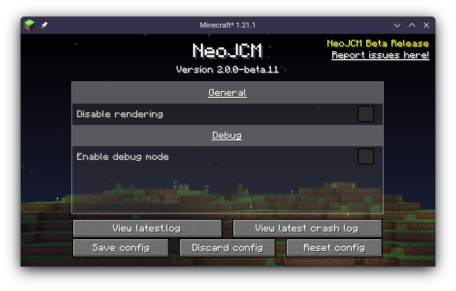
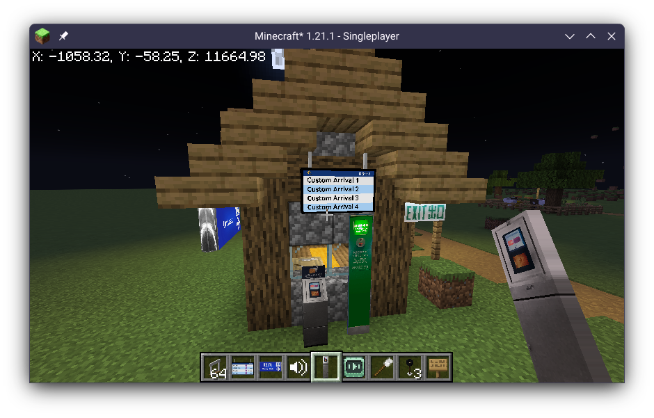

# NeoJCM
NeoJCM is a derived version of **Joban Client Mod v2** that is designed to target NeoMTR, a derived version of MTR 3.0.

The GitHub repository can be found at [https://github.com/Kenny-Hui/NeoJCM](https://github.com/Kenny-Hui/NeoJCM).

Support for using this version is limited, and there is no guarentee on when a new version will release/when will a bug be fixed. It is also not widely tested, as such you should exercise regular risk management such as backing up your world regularly shall you wish to use this.

While not the initial goal, the source code also serves as a pointer to a port of JCM to MTR 4.1, where the Minecraft-Mappings framework will no longer be used.

## Screenshots

