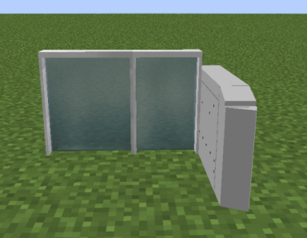

---
block_ids:
- jsblock:thales_ticket_barrier_entrance
- jsblock:thales_ticket_barrier_exit
- jsblock:thales_ticket_barrier_bare
since: 1.0.6
image: JCM_thales_ticket_barriers.png
item_group: JCM Blocks
creator: AozoraSky
assets_creator: Unown A
transparent: true
light_level: 0
recipes:
- jsblock:thales_ticket_barrier_entrance
- jsblock:thales_ticket_barrier_exit
- jsblock:thales_ticket_barrier_bare
---

**Thales Ticket Barriers** is a series of ticket barriers in Joban Client Mod, modelled after a variant of Ticket Barriers manufactured by the **Thales Group**.

## Usage
### Thales Ticket Barrier (Entrance/Exit)
You can walk through the ticket barrier in a defined station area to pass through the gates.

They function identically to the Ticket Barriers in the MTR mod.

### Thales Ticket Barrier (Bare)
By placing an MTR fence next to the Thales Ticket Barrier (Bare) variant, the barrier will automatically connect to the fence with a shorter variants.

## Crafting Recipe
### Ticket Barrier (Entrance)

    

        <!-- row 1 -->
        

        

        

        <!-- row 2 -->
        

        

        

        <!-- row 3 -->
        

        

        

    

    

    

        
    

### Ticket Barrier (Exit)

    

        <!-- row 1 -->
        

        

        

        <!-- row 2 -->
        

        

        

        <!-- row 3 -->
        

        

        

    

    

    

        
    

### Ticket Barrier (Bare)

    

        <!-- row 1 -->
        

        

        

        <!-- row 2 -->
        

        

        

        <!-- row 3 -->
        

        

        

    

    

    

        
    

## Block states
### Thales Ticket Barrier (Entrance / Exit)
| facing | open               |
|:-------|:-------------------|
| north  | closed             |
| east   | pending            |
| south  | open               |
| west   | open_concessionary |

### Thales Ticket Barrier (Bare)
| facing | type | flipped |
|:-------|:-----|:--------|
| north  | 0    | true    |
| east   | 1    | false   |
| south  | 2    |         |
| west   | 3    |         |
|        | 4    |         |
|        | 5    |         |
|        | 6    |         |
|        | 7    |         |
|        | 8    |         |
|        | 9    |         |
|        | 10   |         |

### History
| Version | Changes Made                                                  |
|:--------|:--------------------------------------------------------------|
| v1.0.6  | Added Thales Ticket Barrier                                   |
| v1.1.5  | Improved Thales Ticket Barrier Block Model                    |
| v1.1.6  | Make Thales Ticket Barrier (Bare) attachable to MTR Fence     |
| v1.2.2  | Make fence stay as is if a block is next to the barrier fence |
| v2.0.0  | Rename `jsblock:ticket_barrier_1_entrance` to `jsblock:thales_ticket_barrier_entrance` Rename `jsblock:ticket_barrier_1_exit` to `jsblock:thales_ticket_barrier_exit` Rename `jsblock:ticket_barrier_1_bare` to `jsblock:thales_ticket_barrier_bare` |
