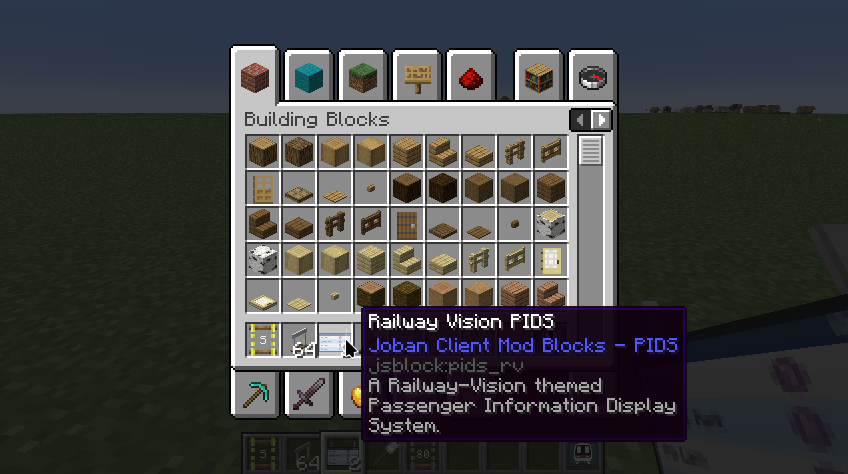
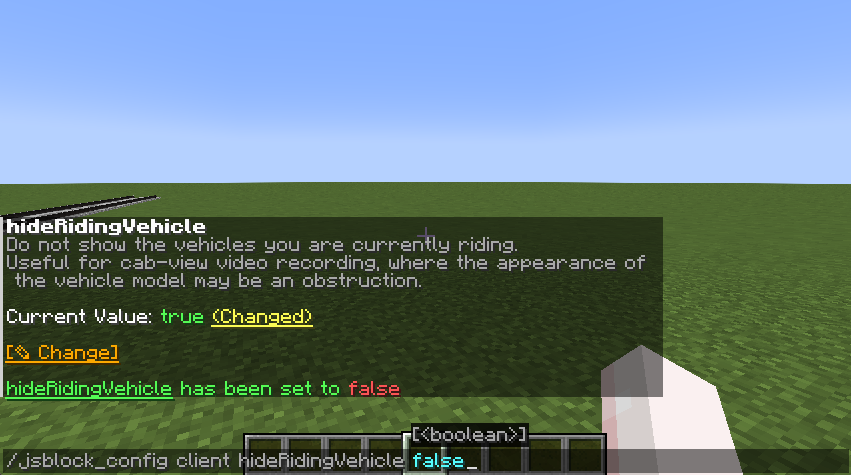

JCM integrates with other mods to provide a complete experience for modded players, which are listed below.

## Item Descriptions
[Item Descriptions](https://modrinth.com/mod/item-descriptions) is a mod that adds a short textual description to in-game blocks/item/entities.

JCM also adds textual description for its block item, which can be viewed by holding the Ctrl key with Item Descriptions installed.

## QoMC (Fabric-only)
If you wish to use a Minecraft command-based interface to edit JCM's config, you can install [QoMC](https://modrinth.com/mod/qomc), which will automatically provide a `/jsblock_config` command, allowing you to change the config value in real-time.

