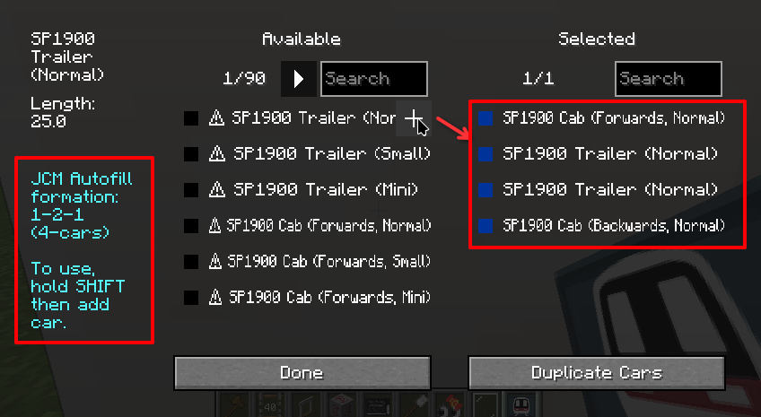

The **MTR Patch** is a set of patches/changes to the MTR Mod, which is made by JCM in order to improve the MTR 4 user experience. (Such as UX, performance etc.)

It is hoped that eventually these patch will be upstreamed to the main MTR Mod, providing an overall better user experience without the reliance of addon mods.

The current patch set includes:

## Optimization-Related
- Reduce lag spikes and memory consumption when loading 3D vehicle/object models
- Attempt to improve frame-rate slightly through means of caching and lazy-evaluation

## Bug fixes / Migration issues
- Fix MTR 4 not recognizing path traversal (e.g. `../`, `..\`) for OBJ textures, which was previously supported in NTE.
- Fix MTR 4 not recognizing legacy NTE object's `translation`, `rotation`, `scale` and `mirror` fields in resource packs.
- Automatically replace MTR 3 reference of gangway & barrier textures to MTR 4, solving issues of MTR 3 pack gangway textures being missing.

## User Interface / UX
For vehicles sets/families formatted appropriately, you may now hold the `SHIFT` key when adding vehicles in Siding to automatically fill out the entire siding length.  
(Formation: Cab Front - N number of car trailers - Cab End)

The vehicle id must end in `_cab_1` (Front), `_cab_2` (Back) and `_trailer` (Car trailer) for this feature to be used. Most MTR built-in vehicles follow this rule.

The above changes are applied once JCM is installed.