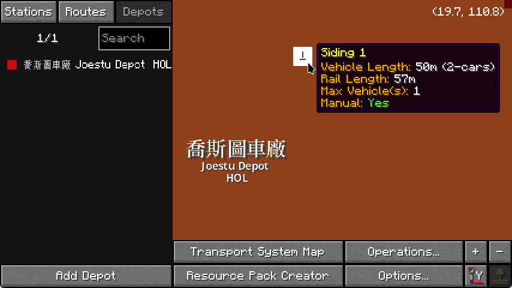

# MTR Enhancements

JCM employs several enhancements for the main MTR mod in hopes of improving the MTR 4.0 User Expereince. They are collectively referred as the **MTR Patch**.  
It is hoped that eventually these patch will be upstreamed to the main MTR Mod, providing an overall better user experience without the reliance of addon mods.

The following outlines the changes made to the MTR mod.

## Optimization-Related
- Reduce lag spikes and memory consumption when loading 3D vehicle/object models
- Attempt to improve frame-rate slightly through means of caching and lazy-evaluation

## Bug fixes / Migration issues
- Fix MTR 4 not recognizing path traversal (e.g. `../`, `..\`) for OBJ textures, which was previously supported in NTE. (Fabric-only)
- Fix MTR 4 not recognizing legacy NTE object's `translation`, `rotation`, `scale` and `mirror` fields in resource packs.

## Feature-parity related
- The **lift ding sound** feature from MTR 3 has been re-enabled.

## User Interface / UX
### Car auto-fill
For vehicles sets/families formatted appropriately, you may now hold the `SHIFT` key when adding vehicles in Siding to automatically fill out the entire siding length.  
(Formation: Cab Front - N number of car trailers - Cab End)

The vehicle id must end in `_cab_1` (Front), `_cab_2` (Back) and `_trailer` (Car trailer) for this feature to be used. Most MTR built-in vehicles follow this rule.

You may also clear all carriages within the Siding by holding `SHIFT` and deleting any one of the selected carriage.

### Dashboard Tooltips
When hovering your mouse over a Platform/Siding, it will now show some properties of the platform/siding.

!!! tip "Tooltip overflow"
    Note that the tooltip may overflow the screen in some cases due to the route name being too long.  
    It is recommended to pair this with mods like [ToolTipFix](https://modrinth.com/mod/tooltipfix) to ensure the content is wrapped in a comfortable way for viewing.

### Hide rail rendering
For debugging purposes and easier discovery of blocks beneath rails, you can now turn off rail rendering completely in JCM's settings.  
This feature is carried over from NTE.

### Hide currently-riding vehicle
This hides the vehicle the player is currently riding, which is useful especially for cab-view video without the obstruction of the train model.  
This feature is carried over from NTE.