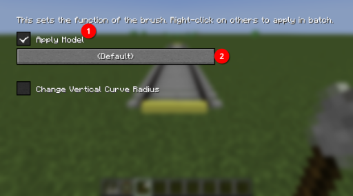

# Tunnel Wall
In Joban Client Mod v2, it is now possible to add tunnel wall in the form of a **Rail Model**, instead of using in its [block form](../blocks/circle_walls.md) which is suboptimal during curves.

## Adding tunnel wall along a track
### 1. Connect a rail

### 2. Shift-Right click the Rail Node with the MTR Brush Item, check the **Apply Model** checkbox, then click on the button below

### 3. Select the **JCM Circular Tunnel**

### 4. Finished!

