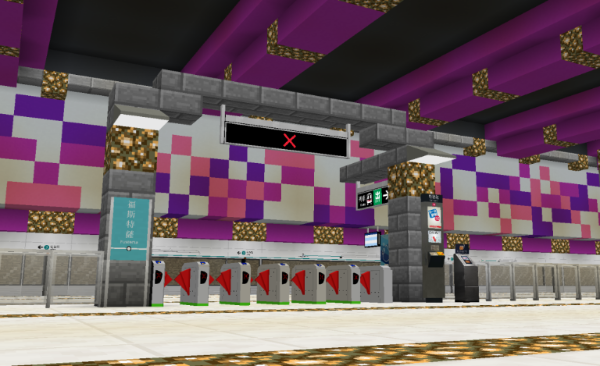

# Welcome to Joban Client Mod!
**Joban Client Mod** (Abbreviated as **JCM**) is an addon of the [Minecraft Transit Railway](https://minecrafttransitrailway.com) mod, adding various railway facilities blocks seen in the **Hong Kong MTR Network**, as well as other blocks which may be helpful to your building.

## :octicons-download-24: Download and install
See [:octicons-download-24: Download & Install](./download.md)

## :octicons-package-24: Blocks
See [:octicons-package-24: Blocks](./blocks/index.md) for details of all the blocks in JCM.

## :octicons-archive-24: Historic Releases
See [:octicons-archive-24: Version Archive](./versions/index.md) to check the changelog & download historic releases of Joban Client Mod.

## FAQ
!!! question "Will you continue development of v1?"
    No, Joban Client Mod v1 is completely abandoned in favor of v2, any new modification should be carried out in v2.

??? question "Will you upload this mod to CurseForge?"
    No plan at the moment, sorry. It's easier to work with a single platform, and Modrinth's API is much more open.

??? question "Can I include your mod in my modpack?"
    Yes!