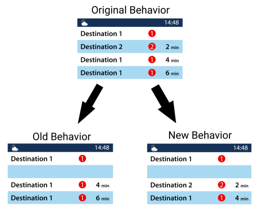

## Compatible MTR Version
Only 3.0.1

## Addition

* [KCR Enquiry Machine (Wall mounted)](../blocks/kcr_enquiry_machine.md)
* [Station Ceiling Panel](../blocks/station_ceilings_wrl.md) (w/ Ceiling Pole)
* New variants of SIL PIDS & improved the original SIL PIDS.
* Added 1.19 support.
* [Light Source Block](../blocks/light_source_block.md): (Light Level can now be changed, and now displays an icon similar to barrier)

## Changes

* [Auto Iron Door](../blocks/auto_iron_door.md) now opens/close quicker.
* [Sound Looper](../blocks/sound_looper.md) can now be limited to a range between 2 coordinates.
* When you hide a row in the LCD PIDS & RV PIDS, the next train entry will be pushed to the next row. '''See below for images.'''
* On the LCD PIDS & RV PIDS, you can now use the following variables:  `{time}` - returns Minecraft daytime in HH:MM (24h)  `{weather}` - returns `Sunny`, `Thundering`, `Rainy`

## Downloads
[Published on Modrinth](https://modrinth.com/mod/jcm/versions), or download with the following links:

- [Fabric 1.19](https://joban.org/JCM/1.1.2/Joban-Client-Mod-fabric-1.19-1.1.2.jar)
- [Fabric 1.18.2](https://joban.org/JCM/1.1.2/Joban-Client-Mod-fabric-1.18.2-1.1.2.jar)
- [Fabric 1.17.1](https://joban.org/JCM/1.1.2/Joban-Client-Mod-fabric-1.17.1-1.1.2.jar)
- [Fabric 1.16.5](https://joban.org/JCM/1.1.2/Joban-Client-Mod-fabric-1.16.5-1.1.2.jar)
- [Forge 1.19](https://joban.org/JCM/1.1.2/Joban-Client-Mod-forge-1.19-1.1.2.jar)
- [Forge 1.18.2](https://joban.org/JCM/1.1.2/Joban-Client-Mod-forge-1.18.2-1.1.2.jar)
- [Forge 1.17.1](https://joban.org/JCM/1.1.2/Joban-Client-Mod-forge-1.17.1-1.1.2.jar)
- [Forge 1.16.5](https://joban.org/JCM/1.1.2/Joban-Client-Mod-forge-1.16.5-1.1.2.jar)

## New PIDS Behavior

[[File:JCM 1.1.2 PIDS Behavior.png|none|thumb|544x544px]]